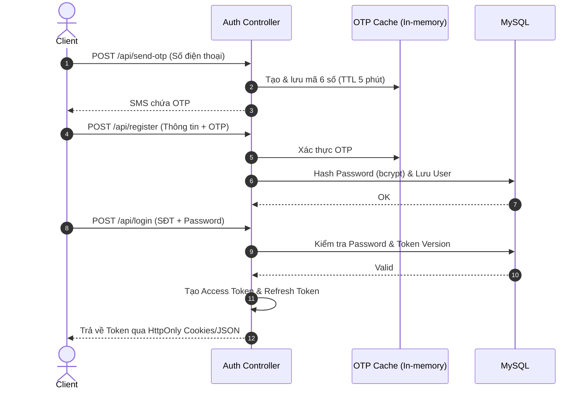
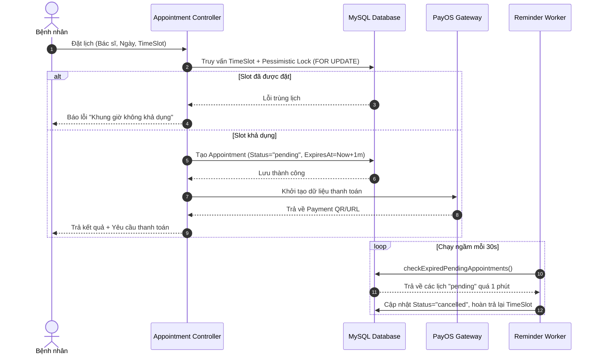
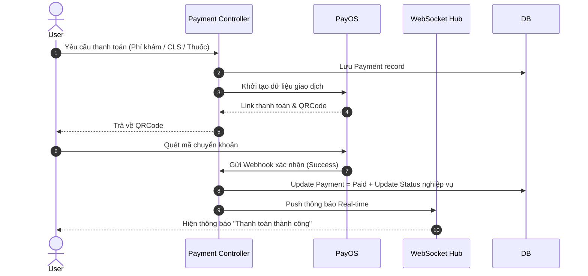
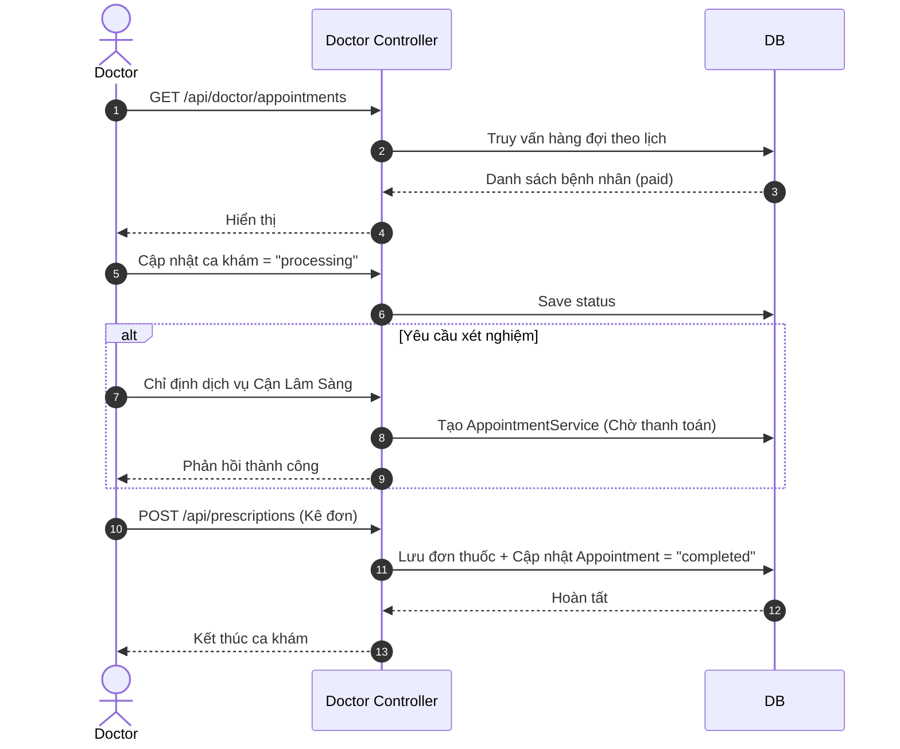
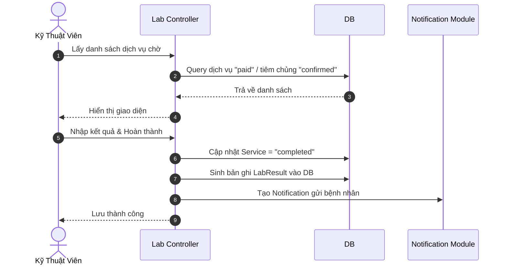
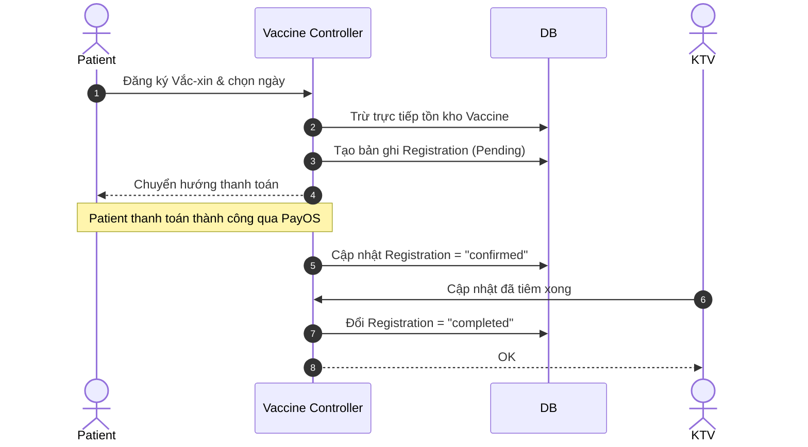
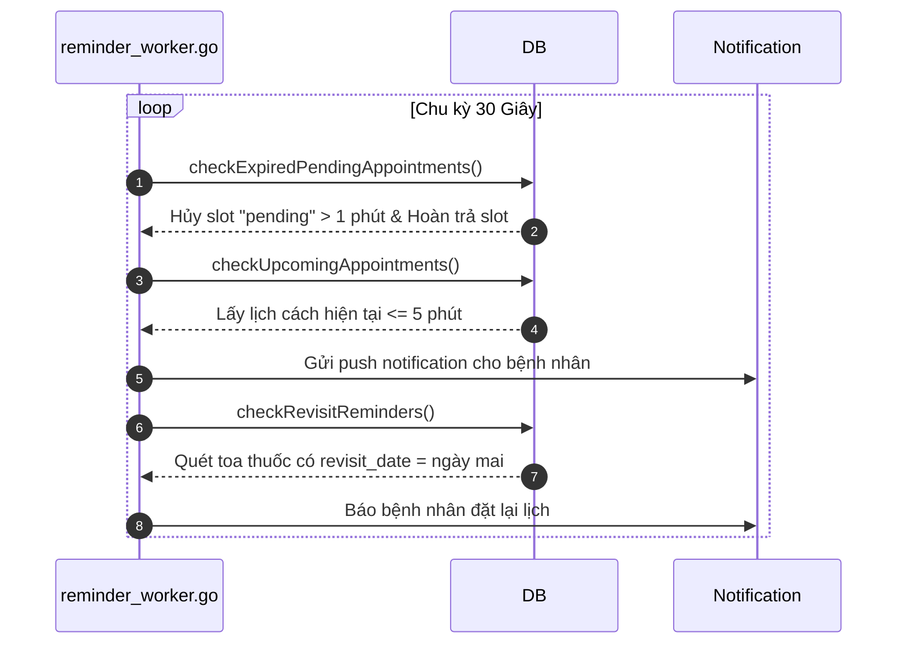
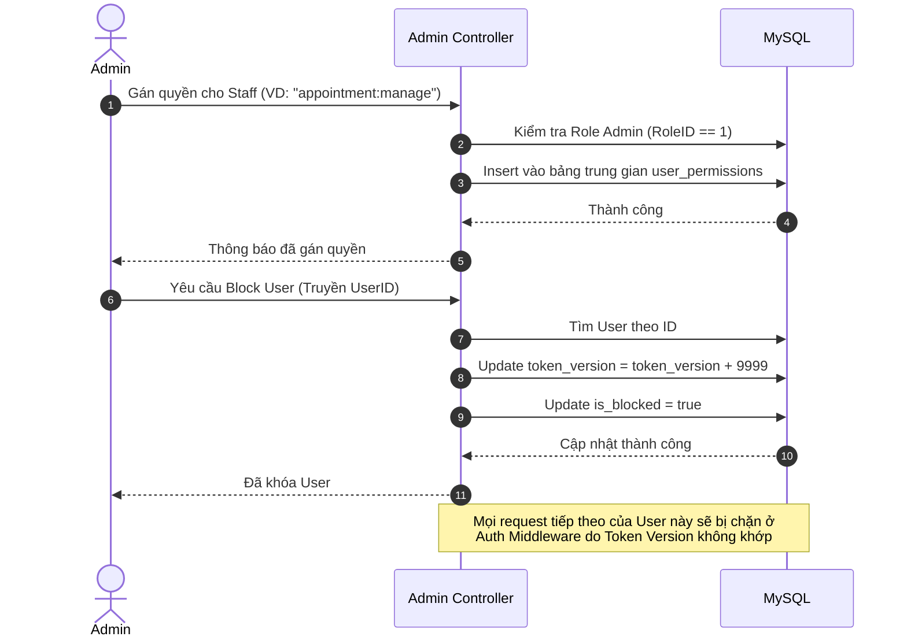
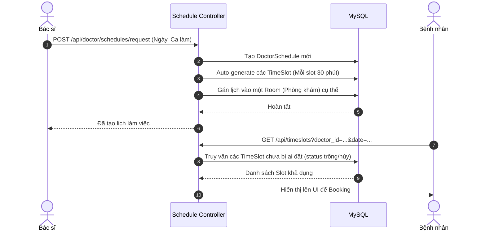

# TÀI LIỆU LUỒNG KIẾN TRÚC BACKEND (UMC CARE)

## 1. Tổng Quan Kiến Trúc

Dự án UMC Care sử dụng kiến trúc MVC (Model-View-Controller) trên nền tảng Golang, tương tác với MySQL thông qua GORM và định tuyến bằng thư viện `net/http` thuần. Luồng xử lý chung bao gồm Middleware kiểm tra JWT và phân quyền (RBAC), Controller xử lý logic nghiệp vụ, và Model tương tác với cơ sở dữ liệu.

## 2. Danh Sách Các Tính Năng

1. Xác Thực & Phân Quyền (Auth & RBAC)
2. Đặt Lịch Khám Bệnh (Booking)
3. Thanh Toán & Hóa Đơn (Payment)
4. Phân Hệ Khám Bệnh (Doctor Portal)
5. Phân Hệ Cận Lâm Sàng (Lab Technician)
6. Quản Lý Tiêm Chủng (Vaccination)
7. Tác Vụ Ngầm (Background Workers)
8. Phân Hệ Admin & Quản Trị Hệ Thống (Admin Portal)
9. Quản Lý Lịch Làm Việc & Ca Trực (Doctor Schedule)

---

## 3. Chi Tiết Luồng Từng Tính Năng

### 3.1 Xác Thực & Phân Quyền (Auth & RBAC)

- **API Endpoints:** `POST /api/login`, `POST /api/register`, `POST /api/send-otp`
- **Mô tả:** Người dùng xác thực bằng số điện thoại và mật khẩu, nhận về Access Token (15 phút) và Refresh Token (7 ngày). Hệ thống áp dụng kiểm tra Token Version để vô hiệu hóa token cũ khi bị giáng quyền hoặc đổi mật khẩu. Các quyền được kiểm tra qua RBAC với 5 vai trò (Admin bypass mọi quyền).
- **Các file liên quan:** `controllers/auth_controller.go`, `middlewares/auth_middleware.go`, `utils/jwt.go`.

---

### 3.2 Đặt Lịch Khám Bệnh (Booking Appointment)

- **API Endpoints:** `POST /api/appointments`
- **Mô tả:** Bệnh nhân chọn ngày và TimeSlot của bác sĩ. Hệ thống sử dụng khóa bi quan (FOR UPDATE) để chặn trùng lịch, thiết lập trạng thái "pending" và giữ chỗ trong đúng 1 phút.
- **Các file liên quan:** `controllers/appointment_controller.go`, `models/appointment.go`.

---

### 3.3 Luồng Thanh Toán (Payment)

- **API Endpoints:** `POST /api/payments`, `POST /api/payments/clinical`, `POST /api/payments/vaccination`
- **Mô tả:** Tích hợp với PayOS để sinh mã VietQR thanh toán cho các dịch vụ: khám bệnh, cận lâm sàng, thuốc và tiêm chủng. Hỗ trợ Webhook xử lý giao dịch tự động và báo cáo thời gian thực qua WebSocket.
- **Các file liên quan:** `controllers/payment_controller.go`, `utils/payos.go`, `utils/websocket.go`.

---

### 3.4 Phân Hệ Khám Bệnh (Doctor Portal)

- **API Endpoints:** `GET /api/doctor/appointments`, `POST /api/appointment-services/bulk`, `POST /api/prescriptions`
- **Mô tả:** Bác sĩ nhận hàng đợi, cập nhật trạng thái "processing", chỉ định xét nghiệm (CLS), và kết thúc ca khám bằng việc kê đơn thuốc.
- **Các file liên quan:** `controllers/doctor_controller.go`, `models/record.go`.

---

### 3.5 Phân Hệ Cận Lâm Sàng (Lab Technician)

- **API Endpoints:** `GET /api/lab/pending-services`, `PUT /api/lab/services/complete`
- **Mô tả:** Kỹ thuật viên (KTV) tiếp nhận dịch vụ y tế đã thanh toán, thực hiện xét nghiệm, nhập kết quả, tự động tạo hồ sơ bệnh án `LabResult` và gửi thông báo.
- **Các file liên quan:** `controllers/lab_controller.go`, `models/record.go`.

---

### 3.6 Quản Lý Tiêm Chủng (Vaccination)

- **API Endpoints:** `POST /api/vaccinations/*`
- **Mô tả:** Bệnh nhân chọn vắc-xin, hệ thống trừ tồn kho, thanh toán thành công chuyển sang "confirmed". KTV sau đó thực hiện tiêm và cập nhật thành "completed".
- **Các file liên quan:** `controllers/vaccination_controller.go`, `models/vaccination.go`.

---

### 3.7 Hệ Thống Tác Vụ Ngầm (Background Workers)

- **Mô tả:** Chạy tự động chu kỳ 30 giây một lần với 3 nhiệm vụ chính: dọn dẹp lịch hết hạn, nhắc nhở trước 5 phút khi ca khám bắt đầu, và nhắc tái khám.
- **Các file liên quan:** `utils/reminder_worker.go`.

---

### 3.8 Phân Hệ Admin & Quản Trị Hệ Thống (Admin Portal)

- **API Endpoints:** `/api/admin/users`, `/api/admin/staff/permissions`, `/api/admin/staff/promote`
- **Mô tả:** Admin có quyền cao nhất (RoleID=1), có thể gán quyền chi tiết cho Staff hoặc khóa tài khoản. Khi khóa, hệ thống áp dụng kỹ thuật cộng thêm 9999 vào `token_version` để ngay lập tức vô hiệu hóa tất cả JWT cũ của user.
- **Các file liên quan:** `controllers/user_controller.go`, `controllers/permission_controller.go`, `middlewares/admin_middleware.go`.

---

### 3.9 Quản Lý Lịch Làm Việc & Ca Trực (Doctor Schedule)

- **API Endpoints:** `/api/doctor/schedules/request`, `/api/schedules`
- **Mô tả:** Hệ thống quản lý lịch làm việc của Bác sĩ. Bác sĩ đăng ký ca trực, hệ thống tự động sinh ra các `TimeSlot` tương ứng (30 phút/slot) và gắn với Phòng khám. Bệnh nhân sẽ query các slot này để đặt lịch.
- **Các file liên quan:** `controllers/schedule_controller.go`, `models/doctor.go`.

