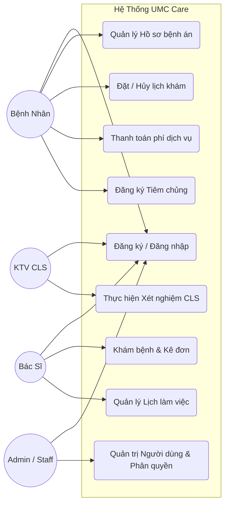
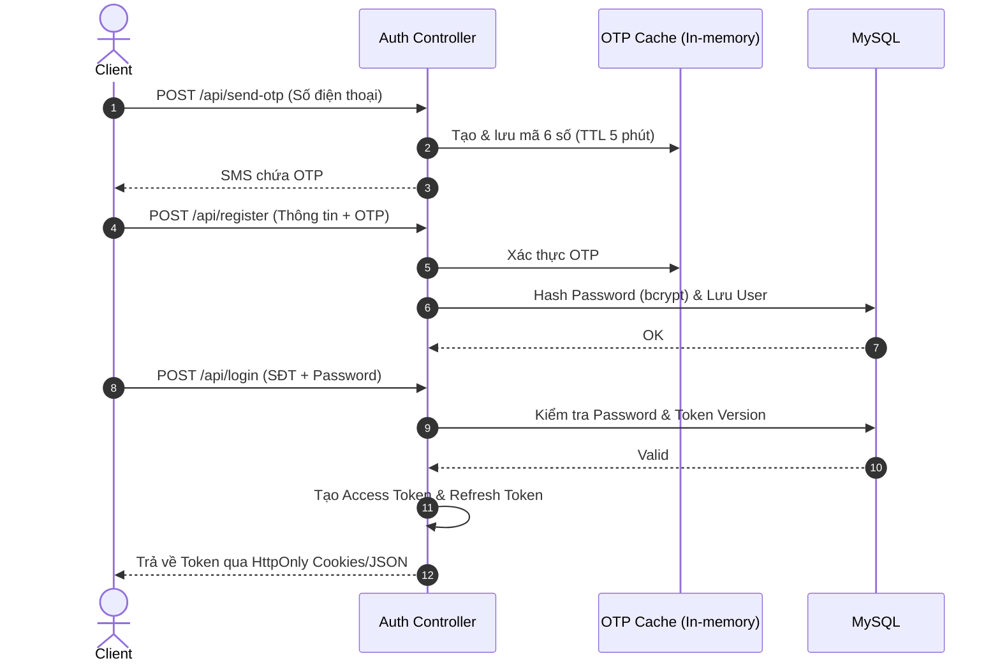
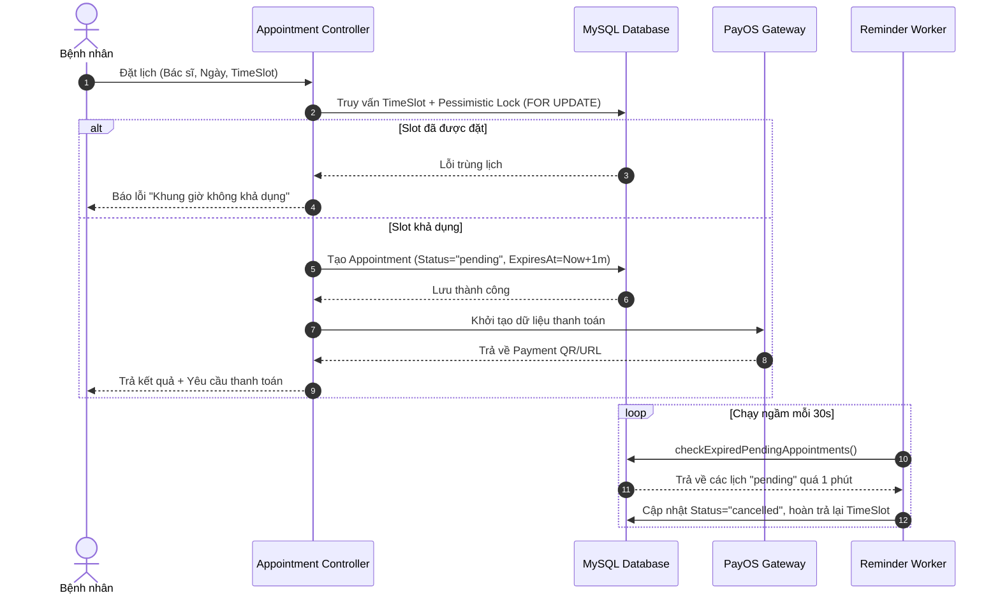
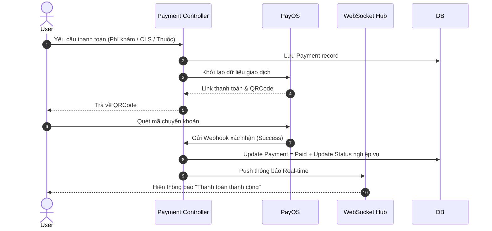
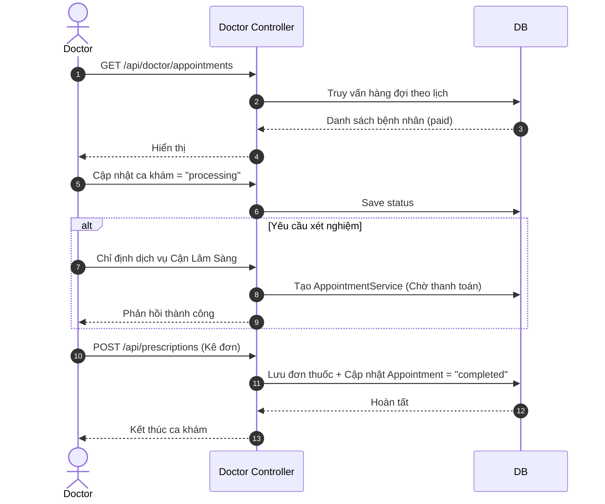
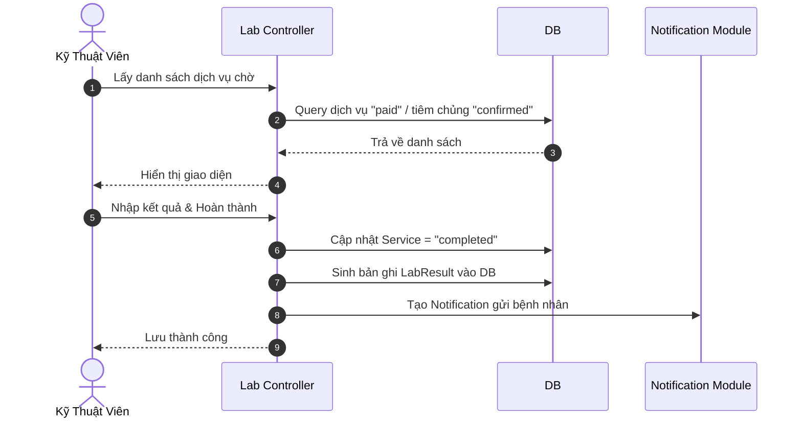
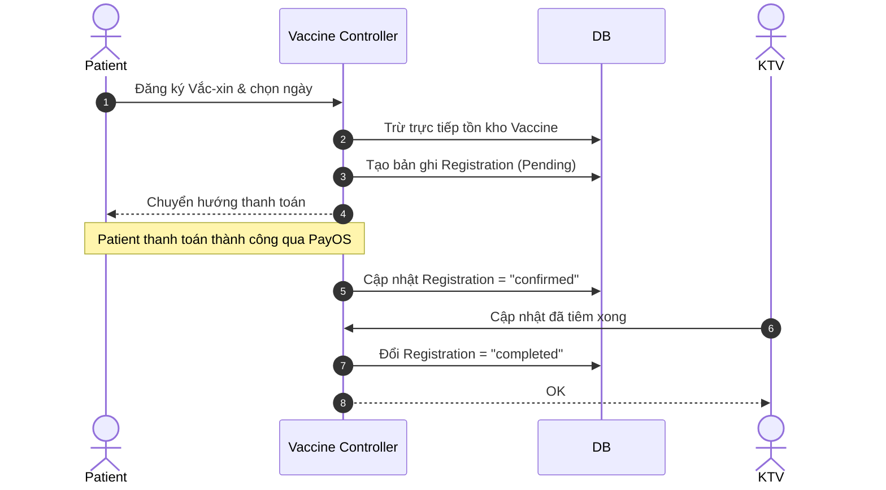
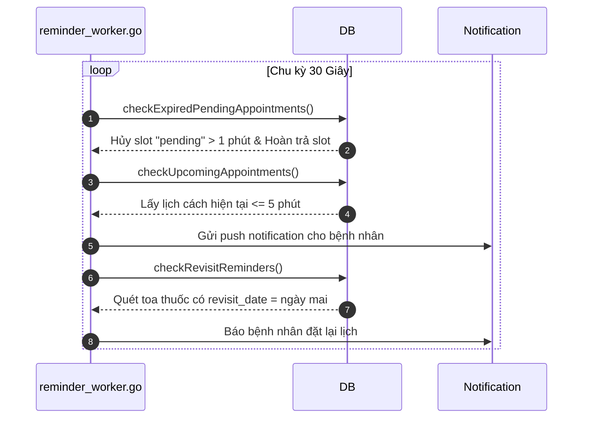
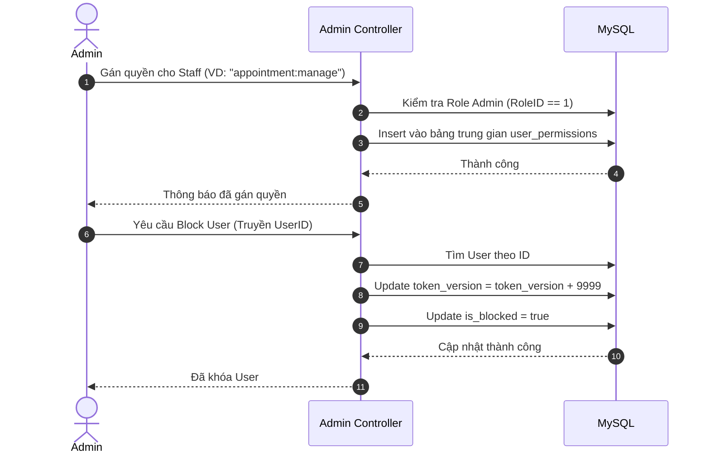
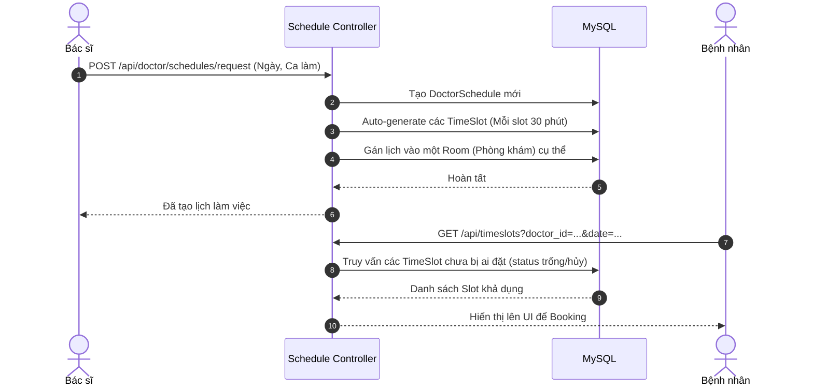

# TÀI LIỆU KIẾN TRÚC VÀ LUỒNG HỆ THỐNG BACKEND (UMC CARE)

## I. TỔNG QUAN KIẾN TRÚC

Dự án UMC Care (Hoàn Mỹ Care) sử dụng kiến trúc MVC (Model-View-Controller) trên nền tảng Golang, tương tác với MySQL thông qua GORM và định tuyến bằng thư viện `net/http` thuần. Hệ thống được bảo mật bằng JWT Token Versioning và phân quyền RBAC đa cấp độ (Admin, Staff, Doctor, LabTech, User).

---

## II. USE CASE HỆ THỐNG

### 1. Sơ Đồ Use Case Tổng Quát

Hệ thống phân chia quyền hạn theo 5 tác nhân (Actor) chính:

### 2. Kịch Bản Chi Tiết Các Use Case Cốt Lõi

_(Trình bày theo chuẩn khung đặc tả kịch bản Use Case)_

 

<i>Bảng 2.1 Kịch bản Đặt lịch khám bệnh</i>

<table border="1" style="border-collapse: collapse; width: 100%; margin-bottom: 20px;">
  <tr>
    <td style="width: 25%; padding: 8px;"><b>Tên use case</b></td>
    <td style="padding: 8px;"><b>Đặt lịch khám bệnh</b></td>
  </tr>
  <tr>
    <td style="padding: 8px;"><b>Tác nhân chính</b></td>
    <td style="padding: 8px;">Người dùng (Bệnh nhân)</td>
  </tr>
  <tr>
    <td style="padding: 8px;"><b>Tiền điều kiện</b></td>
    <td style="padding: 8px;">Người dùng đã đăng nhập vào hệ thống.</td>
  </tr>
  <tr>
    <td style="padding: 8px;"><b>Hậu điều kiện</b></td>
    <td style="padding: 8px;">Lịch khám được tạo thành công, giữ chỗ trong 1 phút chờ thanh toán.</td>
  </tr>
  <tr>
    <td colspan="2" style="padding: 8px;">
      <b>Kịch bản chính</b> 
      1. Người dùng chọn Bác sĩ, Ngày khám mong muốn. 
      2. Hệ thống hiển thị các khung giờ (TimeSlot) còn trống. 
      3. Người dùng chọn 1 khung giờ và nhấn nút "Đặt lịch". 
      4. Hệ thống khóa khung giờ, tạo cuộc hẹn (Appointment) với trạng thái "pending". 
      5. Hệ thống hiển thị thông báo thành công và chuyển sang giao diện thanh toán phí khám.
    </td>
  </tr>
  <tr>
    <td colspan="2" style="padding: 8px;">
      <b>Ngoại lệ</b> 
      1. Khung giờ đã bị người khác đặt trước lúc gửi request: Hệ thống thông báo lỗi "Khung giờ không khả dụng". 
      2. Người dùng không thanh toán sau 1 phút: Worker hệ thống chạy ngầm tự động hủy lịch và trả lại khung giờ.
    </td>
  </tr>
</table>

<i>Bảng 2.2 Kịch bản Khám bệnh và Kê đơn</i>

<table border="1" style="border-collapse: collapse; width: 100%; margin-bottom: 20px;">
  <tr>
    <td style="width: 25%; padding: 8px;"><b>Tên use case</b></td>
    <td style="padding: 8px;"><b>Khám bệnh và Kê đơn</b></td>
  </tr>
  <tr>
    <td style="padding: 8px;"><b>Tác nhân chính</b></td>
    <td style="padding: 8px;">Bác sĩ</td>
  </tr>
  <tr>
    <td style="padding: 8px;"><b>Tiền điều kiện</b></td>
    <td style="padding: 8px;">Bác sĩ đăng nhập vào Portal và bệnh nhân đã thanh toán phí khám.</td>
  </tr>
  <tr>
    <td style="padding: 8px;"><b>Hậu điều kiện</b></td>
    <td style="padding: 8px;">Trạng thái lịch khám chuyển thành "completed", hệ thống sinh đơn thuốc mới.</td>
  </tr>
  <tr>
    <td colspan="2" style="padding: 8px;">
      <b>Kịch bản chính</b> 
      1. Bác sĩ mở giao diện xem hàng đợi bệnh nhân trong ngày. 
      2. Bác sĩ gọi bệnh nhân vào khám (hệ thống cập nhật trạng thái "processing"). 
      3. Bác sĩ nhập chẩn đoán và chọn các loại thuốc cần kê vào đơn. 
      4. Bác sĩ nhấn "Hoàn thành và Kê đơn". 
      5. Hệ thống lưu đơn thuốc, đẩy thông báo thanh toán đơn thuốc cho bệnh nhân và đánh dấu hoàn thành ca khám.
    </td>
  </tr>
  <tr>
    <td colspan="2" style="padding: 8px;">
      <b>Ngoại lệ</b> 
      1. Bác sĩ yêu cầu làm Cận lâm sàng (CLS) trước khi kê đơn: Hệ thống tạo Service yêu cầu thanh toán CLS, ca khám tạm dừng chờ kết quả từ KTV.
    </td>
  </tr>
</table>

<i>Bảng 2.3 Kịch bản Thanh toán dịch vụ (PayOS)</i>

<table border="1" style="border-collapse: collapse; width: 100%; margin-bottom: 20px;">
  <tr>
    <td style="width: 25%; padding: 8px;"><b>Tên use case</b></td>
    <td style="padding: 8px;"><b>Thanh toán dịch vụ (Khám, CLS, Thuốc)</b></td>
  </tr>
  <tr>
    <td style="padding: 8px;"><b>Tác nhân chính</b></td>
    <td style="padding: 8px;">Người dùng (Bệnh nhân)</td>
  </tr>
  <tr>
    <td style="padding: 8px;"><b>Tiền điều kiện</b></td>
    <td style="padding: 8px;">Người dùng có hóa đơn dịch vụ y tế đang ở trạng thái chờ thanh toán.</td>
  </tr>
  <tr>
    <td style="padding: 8px;"><b>Hậu điều kiện</b></td>
    <td style="padding: 8px;">Hóa đơn cập nhật trạng thái "paid", kích hoạt bước nghiệp vụ tiếp theo.</td>
  </tr>
  <tr>
    <td colspan="2" style="padding: 8px;">
      <b>Kịch bản chính</b> 
      1. Người dùng chọn thanh toán cho dịch vụ. 
      2. Hệ thống gọi API PayOS sinh mã VietQR tích hợp số tiền và nội dung chuyển khoản. 
      3. Người dùng mở app ngân hàng quét mã và chuyển tiền. 
      4. PayOS gửi Webhook xác nhận giao dịch thành công về Backend. 
      5. Backend cập nhật dữ liệu và gửi WebSocket báo trạng thái Real-time lên App.
    </td>
  </tr>
  <tr>
    <td colspan="2" style="padding: 8px;">
      <b>Ngoại lệ</b> 
      1. Giao dịch bị hủy do hết hạn mã QR: Hệ thống hủy giao dịch thanh toán chờ.
    </td>
  </tr>
</table>

---

## III. DANH SÁCH CHI TIẾT CÁC LUỒNG TÍNH NĂNG (BACKEND FLOW)

1. Xác Thực & Phân Quyền (Auth & RBAC)
2. Đặt Lịch Khám Bệnh (Booking)
3. Thanh Toán & Hóa Đơn (Payment)
4. Phân Hệ Khám Bệnh (Doctor Portal)
5. Phân Hệ Cận Lâm Sàng (Lab Technician)
6. Quản Lý Tiêm Chủng (Vaccination)
7. Tác Vụ Ngầm (Background Workers)
8. Phân Hệ Admin & Quản Trị Hệ Thống (Admin Portal)
9. Quản Lý Lịch Làm Việc & Ca Trực (Doctor Schedule)

---

## IV. CHI TIẾT SEQUENCE DIAGRAM TỪNG LUỒNG

### Luồng 1. Xác Thực & Phân Quyền (Auth & RBAC)

- **API Endpoints:** `POST /api/login`, `POST /api/register`, `POST /api/send-otp`
- **Mô tả:** Người dùng xác thực bằng số điện thoại và mật khẩu, nhận về Access Token (15 phút) và Refresh Token (7 ngày). Hệ thống áp dụng kiểm tra Token Version để vô hiệu hóa token cũ khi bị giáng quyền hoặc đổi mật khẩu.
- **Các file liên quan:** `auth_controller.go`, `auth_middleware.go`, `jwt.go`.

### Luồng 2. Đặt Lịch Khám Bệnh (Booking Appointment)

- **API Endpoints:** `POST /api/appointments`
- **Mô tả:** Bệnh nhân chọn ngày và TimeSlot của bác sĩ. Sử dụng khóa bi quan (FOR UPDATE) để chặn trùng lịch, thiết lập trạng thái "pending" và giữ chỗ trong đúng 1 phút.
- **Các file liên quan:** `appointment_controller.go`, `models/appointment.go`.

### Luồng 3. Thanh Toán (Payment)

- **API Endpoints:** `POST /api/payments`, `POST /api/payments/clinical`, `POST /api/payments/vaccination`
- **Mô tả:** Tích hợp PayOS sinh VietQR. Hỗ trợ Webhook xử lý giao dịch tự động và báo cáo thời gian thực qua WebSocket.
- **Các file liên quan:** `payment_controller.go`, `payos.go`, `websocket.go`.

### Luồng 4. Phân Hệ Khám Bệnh (Doctor Portal)

- **API Endpoints:** `GET /api/doctor/appointments`, `POST /api/appointment-services/bulk`, `POST /api/prescriptions`
- **Các file liên quan:** `doctor_controller.go`, `models/record.go`.

### Luồng 5. Phân Hệ Cận Lâm Sàng (Lab Technician)

- **API Endpoints:** `GET /api/lab/pending-services`, `PUT /api/lab/services/complete`
- **Các file liên quan:** `lab_controller.go`, `models/record.go`.

### Luồng 6. Quản Lý Tiêm Chủng (Vaccination)

- **API Endpoints:** `POST /api/vaccinations/*`
- **Các file liên quan:** `vaccination_controller.go`, `models/vaccination.go`.

### Luồng 7. Tác Vụ Ngầm (Background Workers)

- **Mô tả:** Chạy tự động 30s/lần với 3 nhiệm vụ: dọn lịch hủy, nhắc nhở trước 5 phút, và nhắc tái khám.
- **Các file liên quan:** `reminder_worker.go`.

### Luồng 8. Phân Hệ Admin & Quản Trị Hệ Thống

- **API Endpoints:** `/api/admin/users`, `/api/admin/staff/permissions`
- **Các file liên quan:** `user_controller.go`, `permission_controller.go`.

### Luồng 9. Quản Lý Lịch Làm Việc & Ca Trực (Doctor Schedule)

- **API Endpoints:** `/api/doctor/schedules/request`, `/api/schedules`
- **Các file liên quan:** `schedule_controller.go`.

