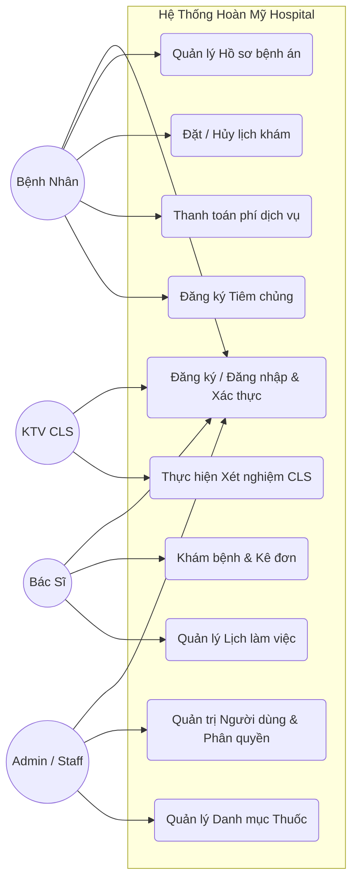
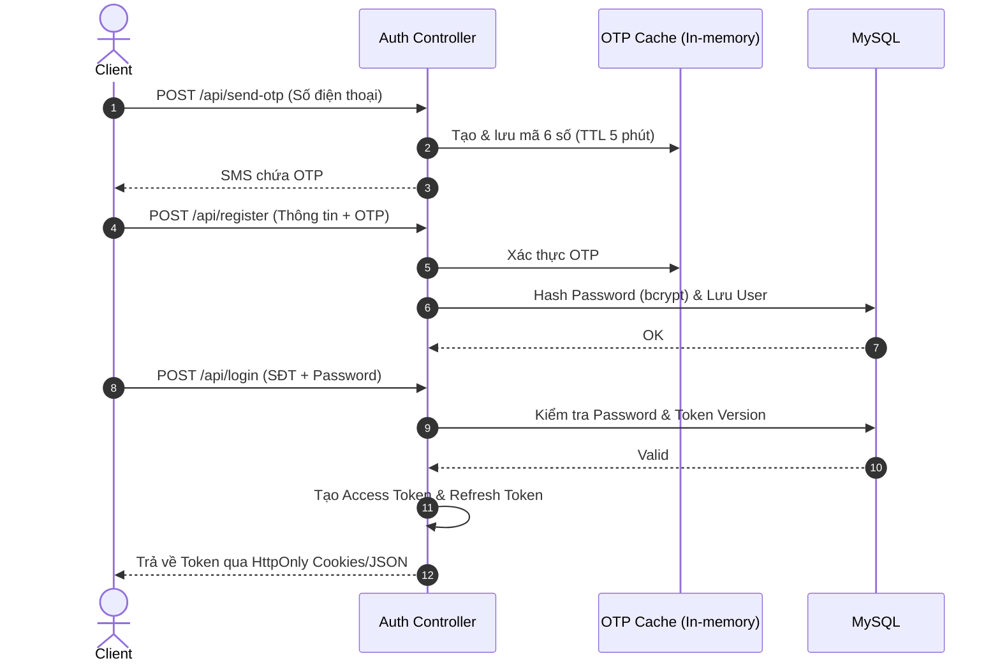
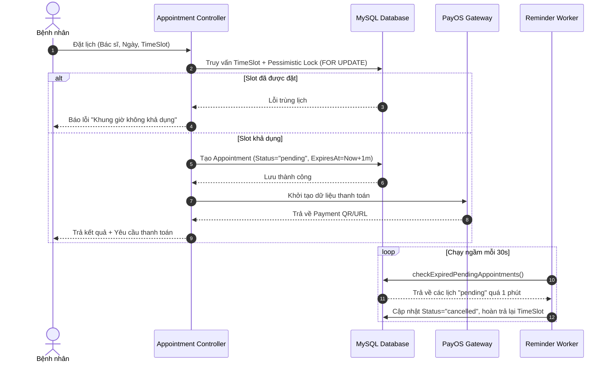
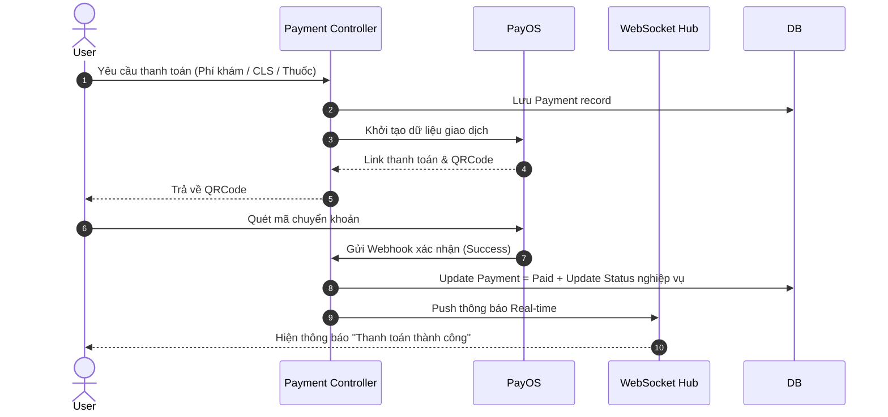
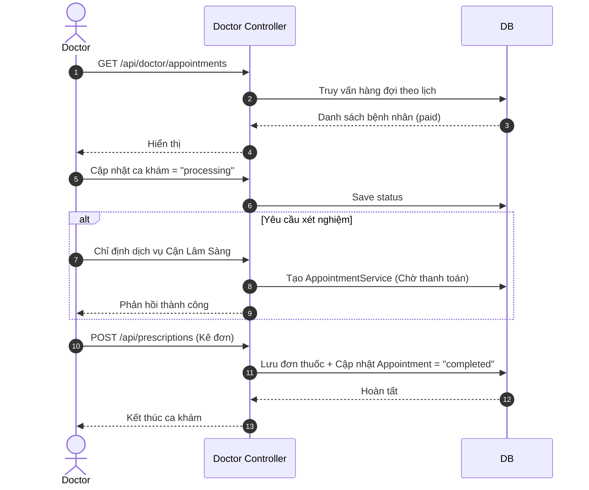
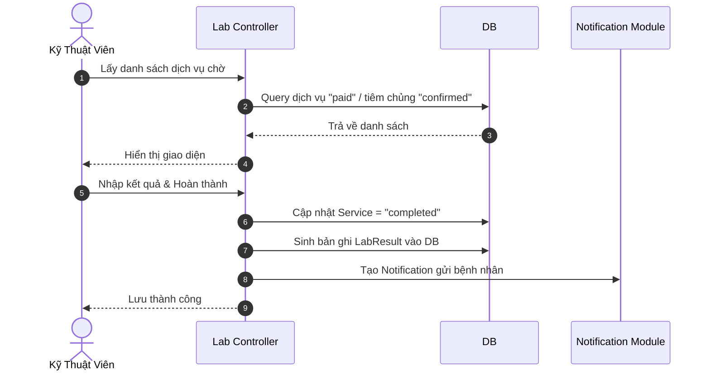
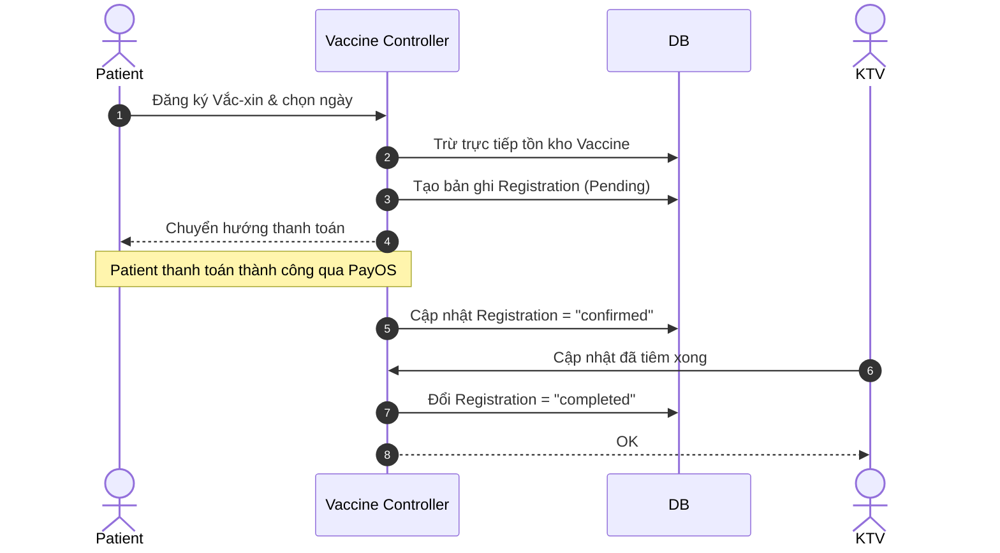
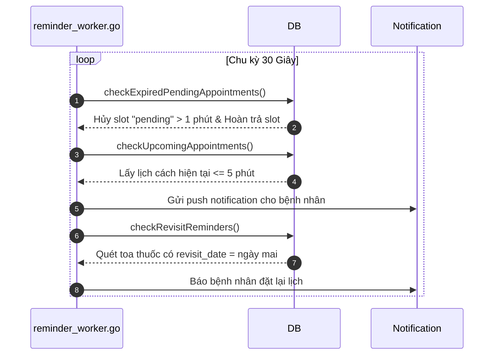
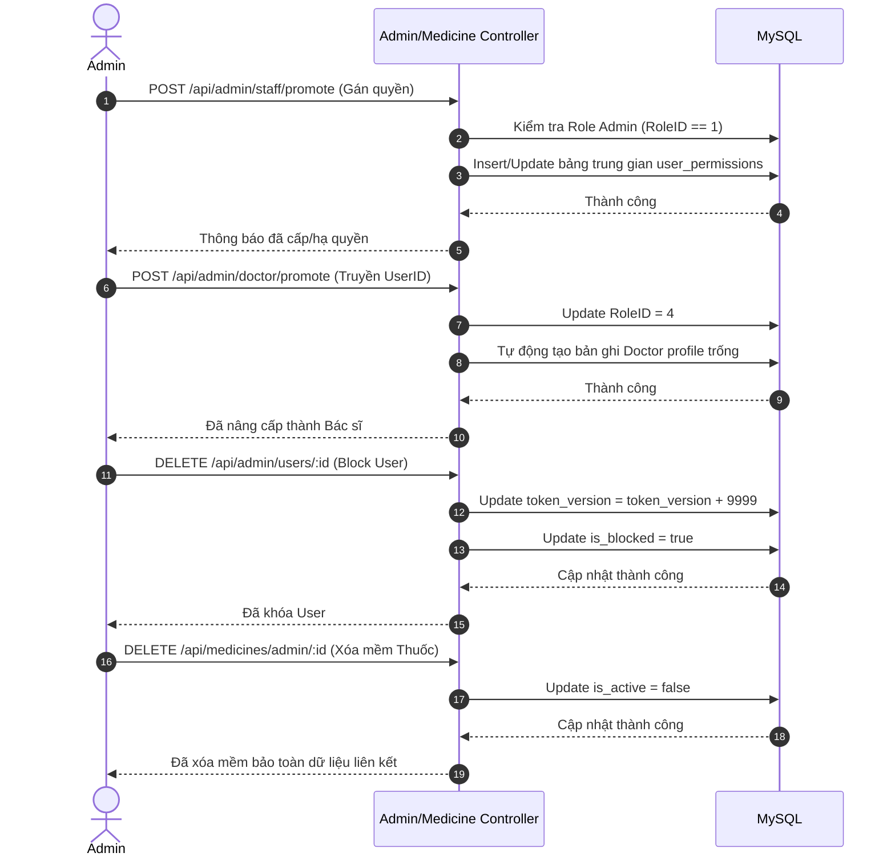
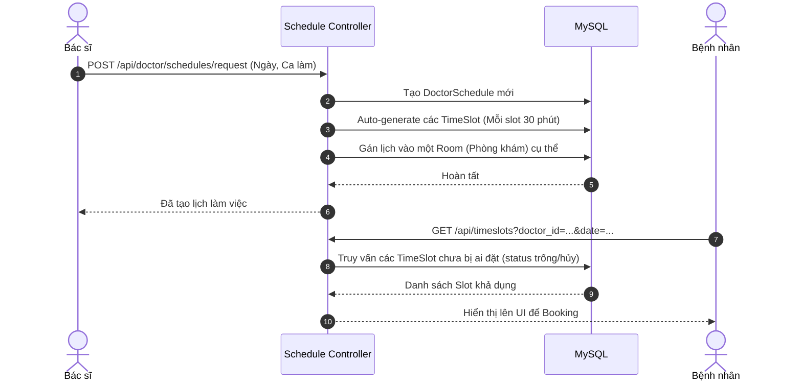

# TÀI LIỆU KIẾN TRÚC VÀ LUỒNG HỆ THỐNG BACKEND (Hoàn Mỹ Hospital)

## I. TỔNG QUAN KIẾN TRÚC

[cite_start]Dự án Hoàn Mỹ Hospital sử dụng kiến trúc MVC (Model-View-Controller) trên nền tảng Golang [cite: 68][cite_start], tương tác với MySQL thông qua GORM và định tuyến bằng thư viện `net/http` thuần[cite: 68]. [cite_start]Hệ thống được bảo mật bằng JWT Token Versioning và phân quyền RBAC đa cấp độ (Admin, Staff, Doctor, LabTech, User)[cite: 73, 76]. [cite_start]Toàn bộ logic được chia thành 16 Controller riêng biệt[cite: 69].

---

## II. USE CASE HỆ THỐNG

### 1. Sơ Đồ Use Case Tổng Quát

### 2. Kịch Bản Chi Tiết Toàn Bộ Use Case

_(Trình bày theo chuẩn khung đặc tả kịch bản Use Case)_

 

<i>Bảng 2.1 Kịch bản Đăng ký tài khoản</i>

<table border="1" style="border-collapse: collapse; width: 100%; margin-bottom: 20px;">
  <tr>
    <td style="width: 25%; padding: 8px;"><b>Tên use case</b></td>
    <td style="padding: 8px;"><b>Đăng ký tài khoản (Có OTP)</b></td>
  </tr>
  <tr>
    <td style="padding: 8px;"><b>Tác nhân chính</b></td>
    <td style="padding: 8px;">Người dùng mới</td>
  </tr>
  <tr>
    <td style="padding: 8px;"><b>Tiền điều kiện</b></td>
    <td style="padding: 8px;">Người dùng chưa có tài khoản trên hệ thống</td>
  </tr>
  <tr>
    <td style="padding: 8px;"><b>Hậu điều kiện</b></td>
    <td style="padding: 8px;">Tài khoản được tạo thành công trong Database</td>
  </tr>
  <tr>
    <td colspan="2" style="padding: 8px;">
      <b>Kịch bản chính</b> 
      1. Người dùng nhập số điện thoại và nhấn "Gửi mã OTP". 
      2. Hệ thống tạo mã OTP 6 số lưu in-memory và gửi SMS cho người dùng[cite: 88]. 
      3. Người dùng nhập thông tin cá nhân, mật khẩu và mã OTP rồi nhấn "Đăng ký". 
      4. Hệ thống xác thực OTP hợp lệ, mã hóa mật khẩu (bcrypt) và tạo User. 
      5. Hệ thống thông báo đăng ký thành công.
    </td>
  </tr>
  <tr>
    <td colspan="2" style="padding: 8px;">
      <b>Ngoại lệ</b> 
      1. Số điện thoại đã tồn tại: Hệ thống báo lỗi tài khoản đã tồn tại. 
      2. Mã OTP sai hoặc hết hạn (quá 5 phút)[cite: 88]: Hệ thống báo lỗi và yêu cầu gửi lại OTP.
    </td>
  </tr>
</table>

<i>Bảng 2.2 Kịch bản Đăng nhập hệ thống</i>

<table border="1" style="border-collapse: collapse; width: 100%; margin-bottom: 20px;">
  <tr>
    <td style="width: 25%; padding: 8px;"><b>Tên use case</b></td>
    <td style="padding: 8px;"><b>Đăng nhập hệ thống</b></td>
  </tr>
  <tr>
    <td style="padding: 8px;"><b>Tác nhân chính</b></td>
    <td style="padding: 8px;">Tất cả người dùng (User, Doctor, LabTech, Admin)</td>
  </tr>
  <tr>
    <td style="padding: 8px;"><b>Tiền điều kiện</b></td>
    <td style="padding: 8px;">Người dùng đã có tài khoản</td>
  </tr>
  <tr>
    <td style="padding: 8px;"><b>Hậu điều kiện</b></td>
    <td style="padding: 8px;">Người dùng nhận được Access Token và Refresh Token</td>
  </tr>
  <tr>
    <td colspan="2" style="padding: 8px;">
      <b>Kịch bản chính</b> 
      1. Người dùng nhập Số điện thoại và Mật khẩu, nhấn "Đăng nhập". 
      2. Hệ thống kiểm tra thông tin đối chiếu với Database. 
      3. Hệ thống sinh JWT Access Token (15 phút) và Refresh Token (7 ngày) đính kèm token_version. 
      4. Hệ thống trả về Cookie hoặc JSON Token và điều hướng đến màn hình chính tương ứng với RoleID.
    </td>
  </tr>
  <tr>
    <td colspan="2" style="padding: 8px;">
      <b>Ngoại lệ</b> 
      1. Sai mật khẩu / Số điện thoại: Hệ thống báo thông tin không chính xác. 
      2. Tài khoản đang bị khóa: Hệ thống từ chối truy cập (403 Forbidden)[cite: 84].
    </td>
  </tr>
</table>

<i>Bảng 2.3 Kịch bản Đặt lịch khám bệnh</i>

<table border="1" style="border-collapse: collapse; width: 100%; margin-bottom: 20px;">
  <tr>
    <td style="width: 25%; padding: 8px;"><b>Tên use case</b></td>
    <td style="padding: 8px;"><b>Đặt lịch khám bệnh</b></td>
  </tr>
  <tr>
    <td style="padding: 8px;"><b>Tác nhân chính</b></td>
    <td style="padding: 8px;">Bệnh nhân</td>
  </tr>
  <tr>
    <td style="padding: 8px;"><b>Tiền điều kiện</b></td>
    <td style="padding: 8px;">Đăng nhập thành công với vai trò User</td>
  </tr>
  <tr>
    <td style="padding: 8px;"><b>Hậu điều kiện</b></td>
    <td style="padding: 8px;">Lịch khám được giữ chỗ trong 1 phút chờ thanh toán [cite: 98]</td>
  </tr>
  <tr>
    <td colspan="2" style="padding: 8px;">
      <b>Kịch bản chính</b> 
      1. Bệnh nhân chọn Bác sĩ, Ngày khám mong muốn. 
      2. Hệ thống hiển thị các khung giờ (TimeSlot) còn trống. 
      3. Bệnh nhân chọn 1 khung giờ và nhấn nút "Đặt lịch". 
      4. Hệ thống khóa khung giờ (FOR UPDATE) [cite: 131], tạo cuộc hẹn (Appointment) trạng thái "pending"[cite: 97]. 
      5. Hệ thống hiển thị thông báo thành công và chuyển sang giao diện thanh toán phí khám.
    </td>
  </tr>
  <tr>
    <td colspan="2" style="padding: 8px;">
      <b>Ngoại lệ</b> 
      1. Khung giờ đã bị người khác đặt trước: Hệ thống thông báo "Khung giờ không khả dụng". 
      2. Bệnh nhân không thanh toán sau 1 phút: Worker tự động hủy lịch, trả lại khung giờ[cite: 98].
    </td>
  </tr>
</table>

<i>Bảng 2.4 Kịch bản Thanh toán dịch vụ (PayOS)</i>

<table border="1" style="border-collapse: collapse; width: 100%; margin-bottom: 20px;">
  <tr>
    <td style="width: 25%; padding: 8px;"><b>Tên use case</b></td>
    <td style="padding: 8px;"><b>Thanh toán dịch vụ (Khám, CLS, Thuốc, Vắc-xin) [cite: 100, 101, 102]</b></td>
  </tr>
  <tr>
    <td style="padding: 8px;"><b>Tác nhân chính</b></td>
    <td style="padding: 8px;">Bệnh nhân</td>
  </tr>
  <tr>
    <td style="padding: 8px;"><b>Tiền điều kiện</b></td>
    <td style="padding: 8px;">Có hóa đơn dịch vụ y tế đang chờ thanh toán</td>
  </tr>
  <tr>
    <td style="padding: 8px;"><b>Hậu điều kiện</b></td>
    <td style="padding: 8px;">Hóa đơn cập nhật "paid"[cite: 97], kích hoạt bước nghiệp vụ tiếp theo</td>
  </tr>
  <tr>
    <td colspan="2" style="padding: 8px;">
      <b>Kịch bản chính</b> 
      1. Bệnh nhân chọn thanh toán cho dịch vụ. 
      2. Hệ thống gọi API PayOS sinh mã VietQR tích hợp số tiền và nội dung[cite: 108]. 
      3. Bệnh nhân quét mã và chuyển tiền. 
      4. PayOS gửi Webhook xác nhận giao dịch thành công về Backend[cite: 102]. 
      5. Backend cập nhật trạng thái "paid" và gửi WebSocket báo trạng thái Real-time lên App[cite: 102].
    </td>
  </tr>
  <tr>
    <td colspan="2" style="padding: 8px;">
      <b>Ngoại lệ</b> 
      1. Giao dịch bị hủy do hết hạn mã QR: Hệ thống hủy phiên thanh toán.
    </td>
  </tr>
</table>

<i>Bảng 2.5 Kịch bản Khám bệnh và Kê đơn</i>

<table border="1" style="border-collapse: collapse; width: 100%; margin-bottom: 20px;">
  <tr>
    <td style="width: 25%; padding: 8px;"><b>Tên use case</b></td>
    <td style="padding: 8px;"><b>Khám bệnh và Kê đơn</b></td>
  </tr>
  <tr>
    <td style="padding: 8px;"><b>Tác nhân chính</b></td>
    <td style="padding: 8px;">Bác sĩ</td>
  </tr>
  <tr>
    <td style="padding: 8px;"><b>Tiền điều kiện</b></td>
    <td style="padding: 8px;">Bác sĩ đăng nhập Portal; Bệnh nhân đã thanh toán phí khám</td>
  </tr>
  <tr>
    <td style="padding: 8px;"><b>Hậu điều kiện</b></td>
    <td style="padding: 8px;">Ca khám chuyển "completed", sinh đơn thuốc mới [cite: 103]</td>
  </tr>
  <tr>
    <td colspan="2" style="padding: 8px;">
      <b>Kịch bản chính</b> 
      1. Bác sĩ mở danh sách hàng đợi bệnh nhân. 
      2. Bác sĩ gọi bệnh nhân (cập nhật trạng thái "processing")[cite: 102]. 
      3. Bác sĩ nhập chẩn đoán, kê thuốc. 
      4. Bác sĩ nhấn "Hoàn thành và Kê đơn"[cite: 103]. 
      5. Hệ thống lưu đơn thuốc, đẩy thông báo cho bệnh nhân và kết thúc ca khám.
    </td>
  </tr>
  <tr>
    <td colspan="2" style="padding: 8px;">
      <b>Ngoại lệ</b> 
      1. Bác sĩ chỉ định Cận lâm sàng (CLS): Hệ thống tạo Service (chờ thanh toán), ca khám tạm dừng chờ kết quả CLS[cite: 102].
    </td>
  </tr>
</table>

<i>Bảng 2.6 Kịch bản Thực hiện Xét nghiệm (CLS)</i>

<table border="1" style="border-collapse: collapse; width: 100%; margin-bottom: 20px;">
  <tr>
    <td style="width: 25%; padding: 8px;"><b>Tên use case</b></td>
    <td style="padding: 8px;"><b>Thực hiện Xét nghiệm (CLS)</b></td>
  </tr>
  <tr>
    <td style="padding: 8px;"><b>Tác nhân chính</b></td>
    <td style="padding: 8px;">Kỹ thuật viên (LabTech)</td>
  </tr>
  <tr>
    <td style="padding: 8px;"><b>Tiền điều kiện</b></td>
    <td style="padding: 8px;">Bệnh nhân đã thanh toán phí chỉ định CLS</td>
  </tr>
  <tr>
    <td style="padding: 8px;"><b>Hậu điều kiện</b></td>
    <td style="padding: 8px;">Bản ghi kết quả (LabResult) được lưu, trạng thái "completed"</td>
  </tr>
  <tr>
    <td colspan="2" style="padding: 8px;">
      <b>Kịch bản chính</b> 
      1. KTV xem danh sách dịch vụ chờ (pending-services). 
      2. KTV chọn bệnh nhân, tiến hành xét nghiệm. 
      3. KTV nhập kết quả vào hệ thống và nhấn "Hoàn thành". 
      4. Hệ thống cập nhật dịch vụ thành "completed" và tự động tạo file LabResult[cite: 103]. 
      5. Hệ thống gửi thông báo (Notification) cho bệnh nhân và bác sĩ chỉ định.
    </td>
  </tr>
  <tr>
    <td colspan="2" style="padding: 8px;">
      <b>Ngoại lệ</b> 
      1. Bệnh nhân chưa thanh toán: Dịch vụ không hiển thị trong danh sách chờ của KTV.
    </td>
  </tr>
</table>

<i>Bảng 2.7 Kịch bản Đăng ký Tiêm chủng</i>

<table border="1" style="border-collapse: collapse; width: 100%; margin-bottom: 20px;">
  <tr>
    <td style="width: 25%; padding: 8px;"><b>Tên use case</b></td>
    <td style="padding: 8px;"><b>Đăng ký Tiêm chủng</b></td>
  </tr>
  <tr>
    <td style="padding: 8px;"><b>Tác nhân chính</b></td>
    <td style="padding: 8px;">Bệnh nhân, Kỹ thuật viên</td>
  </tr>
  <tr>
    <td style="padding: 8px;"><b>Tiền điều kiện</b></td>
    <td style="padding: 8px;">Hệ thống còn tồn kho loại vắc-xin được chọn</td>
  </tr>
  <tr>
    <td style="padding: 8px;"><b>Hậu điều kiện</b></td>
    <td style="padding: 8px;">Mũi tiêm hoàn thành, tồn kho được trừ đi</td>
  </tr>
  <tr>
    <td colspan="2" style="padding: 8px;">
      <b>Kịch bản chính</b> 
      1. Bệnh nhân chọn vắc-xin và ngày tiêm. 
      2. Hệ thống trừ tồn kho vắc-xin, tạo đăng ký "pending"[cite: 103]. 
      3. Bệnh nhân thanh toán thành công, trạng thái chuyển sang "confirmed"[cite: 104]. 
      4. KTV thực hiện tiêm và cập nhật kết quả "completed"[cite: 104].
    </td>
  </tr>
  <tr>
    <td colspan="2" style="padding: 8px;">
      <b>Ngoại lệ</b> 
      1. Hết tồn kho: Hệ thống ẩn/báo lỗi không cho phép đặt loại vắc-xin đó.
    </td>
  </tr>
</table>

<i>Bảng 2.8 Kịch bản Quản lý Lịch làm việc</i>

<table border="1" style="border-collapse: collapse; width: 100%; margin-bottom: 20px;">
  <tr>
    <td style="width: 25%; padding: 8px;"><b>Tên use case</b></td>
    <td style="padding: 8px;"><b>Quản lý Lịch làm việc</b></td>
  </tr>
  <tr>
    <td style="padding: 8px;"><b>Tác nhân chính</b></td>
    <td style="padding: 8px;">Bác sĩ</td>
  </tr>
  <tr>
    <td style="padding: 8px;"><b>Tiền điều kiện</b></td>
    <td style="padding: 8px;">Đăng nhập với vai trò Bác sĩ</td>
  </tr>
  <tr>
    <td style="padding: 8px;"><b>Hậu điều kiện</b></td>
    <td style="padding: 8px;">Các khung giờ (TimeSlot) khám bệnh được sinh ra trên hệ thống</td>
  </tr>
  <tr>
    <td colspan="2" style="padding: 8px;">
      <b>Kịch bản chính</b> 
      1. Bác sĩ vào tính năng Đăng ký ca trực[cite: 129]. 
      2. Bác sĩ chọn Ngày làm việc và Ca làm việc mong muốn. 
      3. Hệ thống tạo DoctorSchedule và tự động sinh ra các TimeSlot (30 phút/slot)[cite: 116]. 
      4. Hệ thống gán lịch vào một Phòng khám trống và công khai cho Bệnh nhân đặt.
    </td>
  </tr>
  <tr>
    <td colspan="2" style="padding: 8px;">
      <b>Ngoại lệ</b> 
      1. Trùng ca trực: Hệ thống báo lỗi lịch làm việc đã tồn tại trong ngày.
    </td>
  </tr>
</table>

<i>Bảng 2.9 Kịch bản Quản trị Người dùng & Phân quyền</i>

<table border="1" style="border-collapse: collapse; width: 100%; margin-bottom: 20px;">
  <tr>
    <td style="width: 25%; padding: 8px;"><b>Tên use case</b></td>
    <td style="padding: 8px;"><b>Quản trị Người dùng, Bác sĩ & Phân quyền</b></td>
  </tr>
  <tr>
    <td style="padding: 8px;"><b>Tác nhân chính</b></td>
    <td style="padding: 8px;">Admin</td>
  </tr>
  <tr>
    <td style="padding: 8px;"><b>Tiền điều kiện</b></td>
    <td style="padding: 8px;">Đăng nhập với RoleID = 1 (Admin) [cite: 84]</td>
  </tr>
  <tr>
    <td style="padding: 8px;"><b>Hậu điều kiện</b></td>
    <td style="padding: 8px;">Tài khoản bị khóa, Staff được thay đổi quyền, hoặc User được nâng cấp lên Bác sĩ</td>
  </tr>
  <tr>
    <td colspan="2" style="padding: 8px;">
      <b>Kịch bản chính</b> 
      1. Admin truy cập danh sách người dùng. 
      2. [Khóa User] Admin chọn Khóa, hệ thống cập nhật `is_blocked = true` và tăng `token_version` +9999 để kích User ra khỏi mọi thiết bị[cite: 87]. 
      3. [Phân quyền Staff] Admin nâng/hạ quyền Staff và tick chọn các permission (VD: `appointment:manage`)[cite: 80, 130]. Hệ thống lưu vào bảng trung gian. 
      4. [Nâng cấp Bác sĩ] Admin chọn chức năng nâng cấp User lên Bác sĩ. Hệ thống tự động chuyển RoleID và tạo một hồ sơ Bác sĩ trống để chuẩn bị cập nhật thông tin.
    </td>
  </tr>
  <tr>
    <td colspan="2" style="padding: 8px;">
      <b>Ngoại lệ</b> 
      1. User cố tình sử dụng Token cũ sau khi bị khóa: Middleware phát hiện sai lệch Token Version, trả về lỗi 401 Session Expired[cite: 82, 83].
    </td>
  </tr>
</table>

<i>Bảng 2.10 Kịch bản Quản lý Danh mục Thuốc</i>

<table border="1" style="border-collapse: collapse; width: 100%; margin-bottom: 20px;">
  <tr>
    <td style="width: 25%; padding: 8px;"><b>Tên use case</b></td>
    <td style="padding: 8px;"><b>Quản lý Danh mục Thuốc</b></td>
  </tr>
  <tr>
    <td style="padding: 8px;"><b>Tác nhân chính</b></td>
    <td style="padding: 8px;">Admin</td>
  </tr>
  <tr>
    <td style="padding: 8px;"><b>Tiền điều kiện</b></td>
    <td style="padding: 8px;">Đăng nhập với RoleID = 1 (Admin)</td>
  </tr>
  <tr>
    <td style="padding: 8px;"><b>Hậu điều kiện</b></td>
    <td style="padding: 8px;">Danh mục thuốc được Thêm/Sửa/Xóa thành công trong hệ thống</td>
  </tr>
  <tr>
    <td colspan="2" style="padding: 8px;">
      <b>Kịch bản chính</b> 
      1. Admin truy cập phân hệ quản lý Thuốc thông qua `medicine_controller.go`[cite: 70]. 
      2. Admin thực hiện các thao tác Thêm hoặc Sửa thông tin thuốc. 
      3. [Xóa Thuốc] Khi Admin chọn Xóa, hệ thống không xóa cứng mà áp dụng Soft Delete (`is_active = false`) nhằm bảo toàn dữ liệu liên kết với các đơn thuốc cũ trong lịch sử[cite: 131].
    </td>
  </tr>
  <tr>
    <td colspan="2" style="padding: 8px;">
      <b>Ngoại lệ</b> 
      1. Thông tin thuốc nhập vào không hợp lệ: Hệ thống báo lỗi validation.
    </td>
  </tr>
</table>

---

## III. DANH SÁCH CHI TIẾT CÁC LUỒNG TÍNH NĂNG (BACKEND FLOW DIAGRAMS)

1. Xác Thực & Phân Quyền (Auth & RBAC)
2. Đặt Lịch Khám Bệnh (Booking)
3. Thanh Toán (Payment)
4. Phân Hệ Khám Bệnh (Doctor Portal)
5. Phân Hệ Cận Lâm Sàng (Lab Technician)
6. Quản Lý Tiêm Chủng (Vaccination)
7. Tác Vụ Ngầm (Background Workers)
8. Phân Hệ Admin, Quản Trị Hệ Thống & Quản Lý Danh Mục (Admin Portal)
9. Quản Lý Lịch Làm Việc & Ca Trực (Doctor Schedule)

---

## IV. CHI TIẾT SEQUENCE DIAGRAM TỪNG LUỒNG

### Luồng 1. Xác Thực & Phân Quyền (Auth & RBAC)

### Luồng 2. Đặt Lịch Khám Bệnh (Booking Appointment)

### Luồng 3. Thanh Toán (Payment)

### Luồng 4. Phân Hệ Khám Bệnh (Doctor Portal)

### Luồng 5. Phân Hệ Cận Lâm Sàng (Lab Technician)

### Luồng 6. Quản Lý Tiêm Chủng (Vaccination)

### Luồng 7. Tác Vụ Ngầm (Background Workers)

### Luồng 8. Phân Hệ Admin, Quản Trị Hệ Thống & Quản Lý Danh Mục

### Luồng 9. Quản Lý Lịch Làm Việc & Ca Trực (Doctor Schedule)

