# TÀI LIỆU ĐẶC TẢ KIẾN TRÚC VÀ USE CASE HỆ THỐNG (Hoàn Mỹ Hospital)

## I. TỔNG QUAN KIẾN TRÚC HỆ THỐNG

Dự án Hệ sinh thái Y tế **Hoàn Mỹ Hospital** sử dụng kiến trúc hệ thống hiện đại, đa nền tảng:

- **Backend:** Xây dựng theo mô hình **MVC (Model-View-Controller)** trên nền tảng **Golang**, giao tiếp với cơ sở dữ liệu **MySQL** thông qua ORM **GORM**. Quản lý định tuyến bằng thư viện `net/http` thuần.
- **Bảo mật & Phân quyền:** Sử dụng JWT Token Versioning (Access Token & Refresh Token lưu trong HttpOnly Cookie / SecureStore) và phân quyền RBAC đa cấp độ (Admin, Staff, Doctor, LabTech, User).
- **Tích hợp bên thứ ba:** Tích hợp cổng thanh toán VNPay / PayOS (WebSocket real-time), dịch vụ SMS OTP (eSMS), và Cloudinary để lưu trữ hóa đơn VAT điện tử.

---

## II. SƠ ĐỒ USE CASE TOÀN BỘ TÍNH NĂNG (PHÂN THEO MODULE)

Để đảm bảo liệt kê đầy đủ 100% các tính năng của dự án mà không làm sơ đồ bị rối rắm (spaghetti lines), hệ thống Use Case được bóc tách thành 3 phân hệ chính. Các tính năng được biểu diễn bằng hình Oval, nằm trong ranh giới hệ thống (System Boundary).

### 1. Phân hệ Bệnh Nhân (Patient Module)

Sơ đồ này mô tả toàn bộ các tương tác và tính năng tiện ích dành riêng cho Bệnh nhân (người dùng cuối trên Mobile App và Web Client).

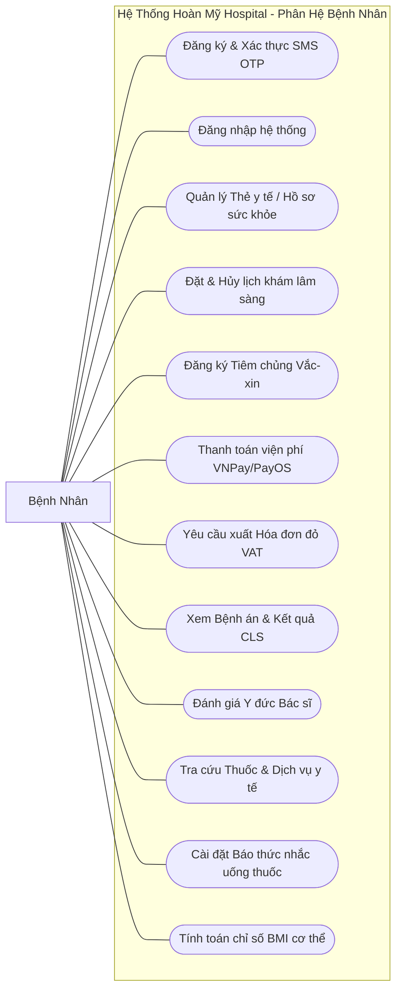

### 2. Phân hệ Chuyên môn (Doctor & LabTech Module)

Sơ đồ này mô tả các nghiệp vụ y khoa dành cho Bác sĩ lâm sàng và Kỹ thuật viên (KTV) cận lâm sàng trên Web Portal nội bộ.

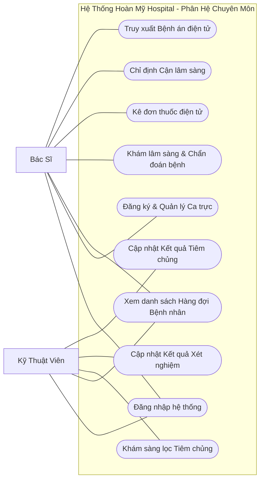

### 3. Phân hệ Quản trị (Admin) & Tác vụ tự động

Sơ đồ này mô tả các chức năng quản trị hệ thống, quản lý danh mục và các tác vụ chạy ngầm tự động (Cron-job / Worker).

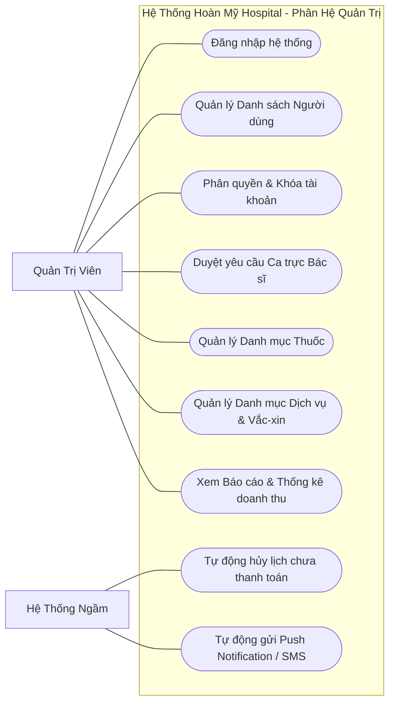

---

## III. ĐẶC TẢ KỊCH BẢN CHI TIẾT TOÀN BỘ CÁC USE CASE

_(Trình bày theo chuẩn khung đặc tả kịch bản Use Case UML)_

### [PHÂN HỆ BỆNH NHÂN]

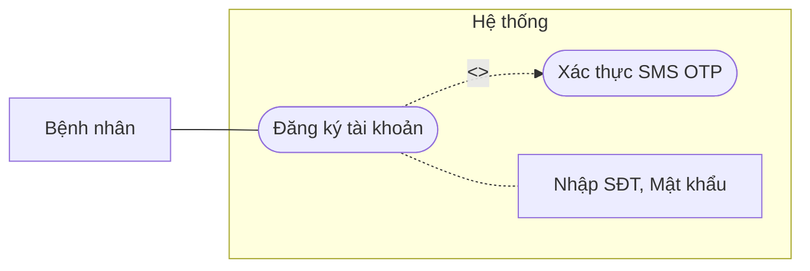

<br>
<div align="center"><i>Bảng 3.1 Kịch bản Đăng ký tài khoản (Tích hợp SMS OTP)</i></div>

<table border="1" style="border-collapse: collapse; width: 100%; margin-bottom: 20px;">
  <tr><td style="width: 25%; padding: 8px;"><b>Tên use case</b></td><td style="padding: 8px;"><b>Đăng ký tài khoản & Xác thực SMS OTP</b></td></tr>
  <tr><td style="padding: 8px;"><b>Tác nhân chính</b></td><td style="padding: 8px;">Bệnh nhân</td></tr>
  <tr><td style="padding: 8px;"><b>Tiền điều kiện</b></td><td style="padding: 8px;">Chưa có tài khoản trên hệ thống</td></tr>
  <tr><td style="padding: 8px;"><b>Hậu điều kiện</b></td><td style="padding: 8px;">Tài khoản được tạo thành công</td></tr>
  <tr><td colspan="2" style="padding: 8px;"><b>Kịch bản chính</b><br>1. Người dùng nhập SĐT và gửi OTP.<br>2. Hệ thống gọi eSMS gửi mã OTP.<br>3. Nhập OTP và thông tin đăng ký.<br>4. Hệ thống xác thực và tạo tài khoản.</td></tr>
  <tr><td colspan="2" style="padding: 8px;"><b>Ngoại lệ</b><br>1. OTP sai/hết hạn: Yêu cầu gửi lại.<br>2. SĐT đã tồn tại: Báo lỗi tài khoản đã tồn tại.</td></tr>
</table>

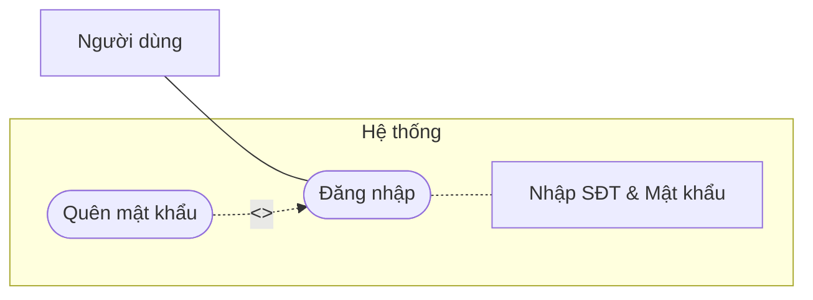

<br>
<div align="center"><i>Bảng 3.2 Kịch bản Đăng nhập hệ thống</i></div>

<table border="1" style="border-collapse: collapse; width: 100%; margin-bottom: 20px;">
  <tr><td style="width: 25%; padding: 8px;"><b>Tên use case</b></td><td style="padding: 8px;"><b>Đăng nhập hệ thống</b></td></tr>
  <tr><td style="padding: 8px;"><b>Tác nhân chính</b></td><td style="padding: 8px;">Mọi người dùng</td></tr>
  <tr><td style="padding: 8px;"><b>Tiền điều kiện</b></td><td style="padding: 8px;">Đã có tài khoản</td></tr>
  <tr><td style="padding: 8px;"><b>Hậu điều kiện</b></td><td style="padding: 8px;">Nhận JWT Token (Access & Refresh)</td></tr>
  <tr><td colspan="2" style="padding: 8px;"><b>Kịch bản chính</b><br>1. Nhập SĐT và Mật khẩu.<br>2. Hệ thống đối chiếu Database.<br>3. Sinh JWT Token và lưu vào SecureStore/Cookie.</td></tr>
  <tr><td colspan="2" style="padding: 8px;"><b>Ngoại lệ</b><br>1. Sai mật khẩu: Báo lỗi.<br>2. Tài khoản bị khóa: Trả về 403 Forbidden.</td></tr>
</table>

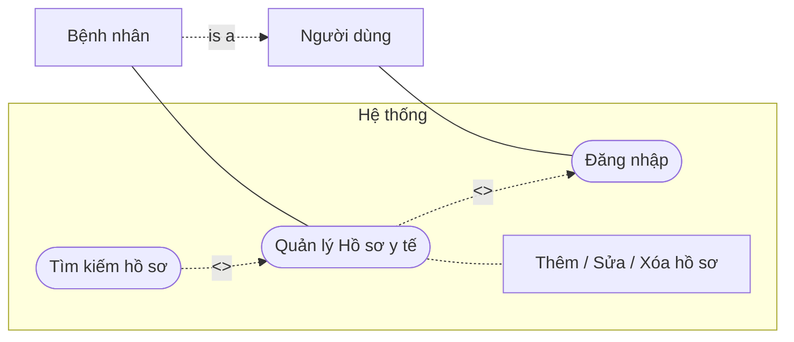

<br>
<div align="center"><i>Bảng 3.3 Kịch bản Quản lý Hồ sơ y tế & Thẻ y tế số</i></div>

<table border="1" style="border-collapse: collapse; width: 100%; margin-bottom: 20px;">
  <tr><td style="width: 25%; padding: 8px;"><b>Tên use case</b></td><td style="padding: 8px;"><b>Quản lý Hồ sơ y tế (Thẻ y tế số)</b></td></tr>
  <tr><td style="padding: 8px;"><b>Tác nhân chính</b></td><td style="padding: 8px;">Bệnh nhân</td></tr>
  <tr><td style="padding: 8px;"><b>Tiền điều kiện</b></td><td style="padding: 8px;">Đã đăng nhập</td></tr>
  <tr><td style="padding: 8px;"><b>Hậu điều kiện</b></td><td style="padding: 8px;">Hồ sơ được cập nhật trong CSDL</td></tr>
  <tr><td colspan="2" style="padding: 8px;"><b>Kịch bản chính</b><br>1. Truy cập mục Hồ sơ y tế.<br>2. Thêm/Sửa/Xóa hồ sơ cá nhân hoặc người thân (nhập tên, ngày sinh, BHYT).<br>3. Hệ thống lưu trữ và cấp Thẻ y tế số định dạng QR.</td></tr>
  <tr><td colspan="2" style="padding: 8px;"><b>Ngoại lệ</b><br>1. Nhập thiếu thông tin bắt buộc: Báo lỗi validation.</td></tr>
</table>

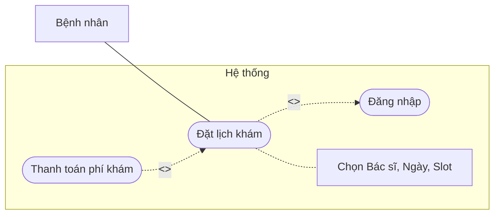

<br>
<div align="center"><i>Bảng 3.4 Kịch bản Đặt lịch khám lâm sàng</i></div>

<table border="1" style="border-collapse: collapse; width: 100%; margin-bottom: 20px;">
  <tr><td style="width: 25%; padding: 8px;"><b>Tên use case</b></td><td style="padding: 8px;"><b>Đặt lịch khám bệnh</b></td></tr>
  <tr><td style="padding: 8px;"><b>Tác nhân chính</b></td><td style="padding: 8px;">Bệnh nhân</td></tr>
  <tr><td style="padding: 8px;"><b>Tiền điều kiện</b></td><td style="padding: 8px;">Đã có hồ sơ y tế</td></tr>
  <tr><td style="padding: 8px;"><b>Hậu điều kiện</b></td><td style="padding: 8px;">Slot khám được giữ chỗ (pending)</td></tr>
  <tr><td colspan="2" style="padding: 8px;"><b>Kịch bản chính</b><br>1. Chọn Bác sĩ, Ngày, và TimeSlot.<br>2. Hệ thống khóa Slot (Pessimistic Locking).<br>3. Chuyển sang thanh toán phí khám.</td></tr>
  <tr><td colspan="2" style="padding: 8px;"><b>Ngoại lệ</b><br>1. Trùng lịch: Báo khung giờ đã bị đặt.<br>2. Không thanh toán: Worker tự hủy lịch sau 1 phút.</td></tr>
</table>

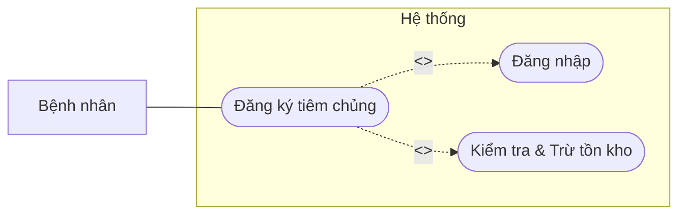

<br>
<div align="center"><i>Bảng 3.5 Kịch bản Đăng ký tiêm chủng Vắc-xin</i></div>

<table border="1" style="border-collapse: collapse; width: 100%; margin-bottom: 20px;">
  <tr><td style="width: 25%; padding: 8px;"><b>Tên use case</b></td><td style="padding: 8px;"><b>Đăng ký Tiêm chủng</b></td></tr>
  <tr><td style="padding: 8px;"><b>Tác nhân chính</b></td><td style="padding: 8px;">Bệnh nhân</td></tr>
  <tr><td style="padding: 8px;"><b>Tiền điều kiện</b></td><td style="padding: 8px;">Vắc-xin còn tồn kho</td></tr>
  <tr><td style="padding: 8px;"><b>Hậu điều kiện</b></td><td style="padding: 8px;">Đơn tiêm chủng được tạo</td></tr>
  <tr><td colspan="2" style="padding: 8px;"><b>Kịch bản chính</b><br>1. Chọn loại vắc-xin và ngày tiêm.<br>2. Hệ thống trừ tạm tồn kho và tạo đơn pending.<br>3. Thanh toán thành công -> Confirmed.</td></tr>
  <tr><td colspan="2" style="padding: 8px;"><b>Ngoại lệ</b><br>1. Hết tồn kho: Báo lỗi hết vắc-xin.</td></tr>
</table>

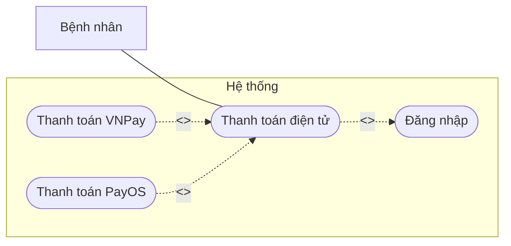

<br>
<div align="center"><i>Bảng 3.6 Kịch bản Thanh toán viện phí (VNPay / PayOS)</i></div>

<table border="1" style="border-collapse: collapse; width: 100%; margin-bottom: 20px;">
  <tr><td style="width: 25%; padding: 8px;"><b>Tên use case</b></td><td style="padding: 8px;"><b>Thanh toán điện tử</b></td></tr>
  <tr><td style="padding: 8px;"><b>Tác nhân chính</b></td><td style="padding: 8px;">Bệnh nhân</td></tr>
  <tr><td style="padding: 8px;"><b>Tiền điều kiện</b></td><td style="padding: 8px;">Có hóa đơn pending</td></tr>
  <tr><td style="padding: 8px;"><b>Hậu điều kiện</b></td><td style="padding: 8px;">Giao dịch thành công (Paid)</td></tr>
  <tr><td colspan="2" style="padding: 8px;"><b>Kịch bản chính</b><br>1. Bệnh nhân quét mã VietQR / VNPay.<br>2. Webhook PayOS/VNPay gửi xác nhận giao dịch về Server.<br>3. Server báo qua WebSocket để App tự động nhảy màn hình thành công.</td></tr>
  <tr><td colspan="2" style="padding: 8px;"><b>Ngoại lệ</b><br>1. Quá hạn mã QR: Phiên thanh toán bị hủy.</td></tr>
</table>

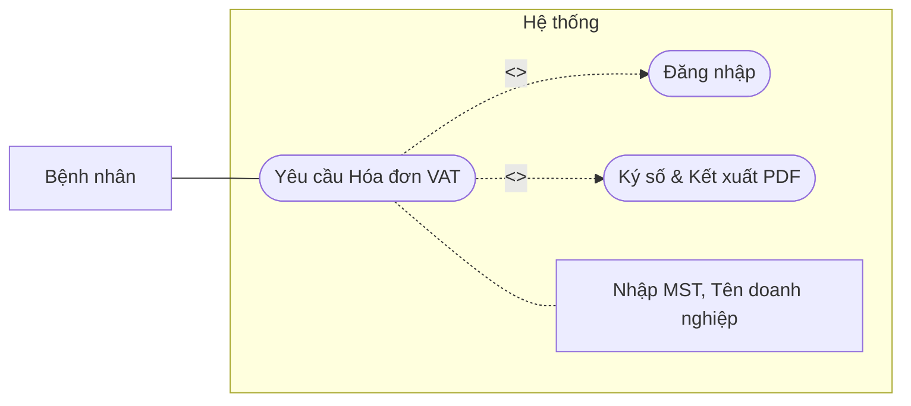

<br>
<div align="center"><i>Bảng 3.7 Kịch bản Xuất hóa đơn đỏ (VAT)</i></div>

<table border="1" style="border-collapse: collapse; width: 100%; margin-bottom: 20px;">
  <tr><td style="width: 25%; padding: 8px;"><b>Tên use case</b></td><td style="padding: 8px;"><b>Yêu cầu xuất Hóa đơn VAT</b></td></tr>
  <tr><td style="padding: 8px;"><b>Tác nhân chính</b></td><td style="padding: 8px;">Bệnh nhân</td></tr>
  <tr><td style="padding: 8px;"><b>Tiền điều kiện</b></td><td style="padding: 8px;">Đã thanh toán thành công dịch vụ</td></tr>
  <tr><td style="padding: 8px;"><b>Hậu điều kiện</b></td><td style="padding: 8px;">File PDF Hóa đơn điện tử được lưu</td></tr>
  <tr><td colspan="2" style="padding: 8px;"><b>Kịch bản chính</b><br>1. Nhập Mã số thuế và thông tin doanh nghiệp.<br>2. Hệ thống kết xuất file PDF gắn chữ ký số của bệnh viện.<br>3. Upload file lên Cloudinary và cung cấp link tải cho bệnh nhân.</td></tr>
  <tr><td colspan="2" style="padding: 8px;"><b>Ngoại lệ</b><br>1. Giao dịch đã xuất hóa đơn: Báo lỗi không cho phép xuất lại để tránh gian lận thuế.</td></tr>
</table>

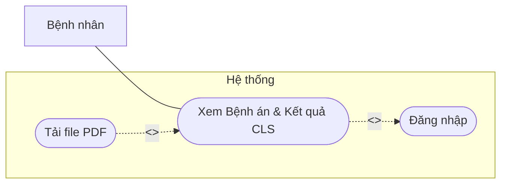

<br>
<div align="center"><i>Bảng 3.8 Kịch bản Xem Bệnh án & Kết quả Xét nghiệm</i></div>

<table border="1" style="border-collapse: collapse; width: 100%; margin-bottom: 20px;">
  <tr><td style="width: 25%; padding: 8px;"><b>Tên use case</b></td><td style="padding: 8px;"><b>Xem Bệnh án & Kết quả CLS</b></td></tr>
  <tr><td style="padding: 8px;"><b>Tác nhân chính</b></td><td style="padding: 8px;">Bệnh nhân</td></tr>
  <tr><td style="padding: 8px;"><b>Tiền điều kiện</b></td><td style="padding: 8px;">Bác sĩ/KTV đã cập nhật kết quả</td></tr>
  <tr><td style="padding: 8px;"><b>Hậu điều kiện</b></td><td style="padding: 8px;">Bệnh nhân xem được file chi tiết</td></tr>
  <tr><td colspan="2" style="padding: 8px;"><b>Kịch bản chính</b><br>1. Bệnh nhân vào Lịch sử khám.<br>2. Bấm xem chi tiết Đơn thuốc điện tử hoặc Kết quả xét nghiệm máu/X-Quang.<br>3. Bệnh nhân có thể tải PDF về máy.</td></tr>
  <tr><td colspan="2" style="padding: 8px;"><b>Ngoại lệ</b><br>Không có</td></tr>
</table>

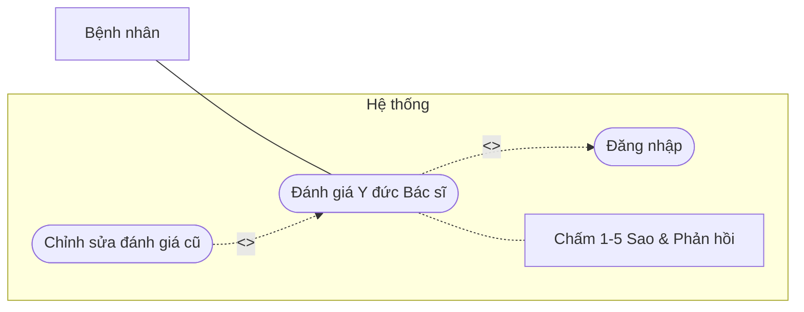

<br>
<div align="center"><i>Bảng 3.9 Kịch bản Đánh giá Y đức Bác sĩ</i></div>

<table border="1" style="border-collapse: collapse; width: 100%; margin-bottom: 20px;">
  <tr><td style="width: 25%; padding: 8px;"><b>Tên use case</b></td><td style="padding: 8px;"><b>Đánh giá Y đức Bác sĩ</b></td></tr>
  <tr><td style="padding: 8px;"><b>Tác nhân chính</b></td><td style="padding: 8px;">Bệnh nhân</td></tr>
  <tr><td style="padding: 8px;"><b>Tiền điều kiện</b></td><td style="padding: 8px;">Đã hoàn thành ca khám lâm sàng</td></tr>
  <tr><td style="padding: 8px;"><b>Hậu điều kiện</b></td><td style="padding: 8px;">Hệ thống lưu điểm Rating (Sao)</td></tr>
  <tr><td colspan="2" style="padding: 8px;"><b>Kịch bản chính</b><br>1. Chọn Bác sĩ vừa khám trong mục Lịch sử.<br>2. Chấm điểm từ 1-5 sao và để lại nhận xét (Review).<br>3. Hệ thống lưu Feedback và tự động cập nhật Rating trung bình của Bác sĩ.</td></tr>
  <tr><td colspan="2" style="padding: 8px;"><b>Ngoại lệ</b><br>1. Đã đánh giá trước đó: Hệ thống chỉ cho phép cập nhật lại/sửa đánh giá cũ.</td></tr>
</table>

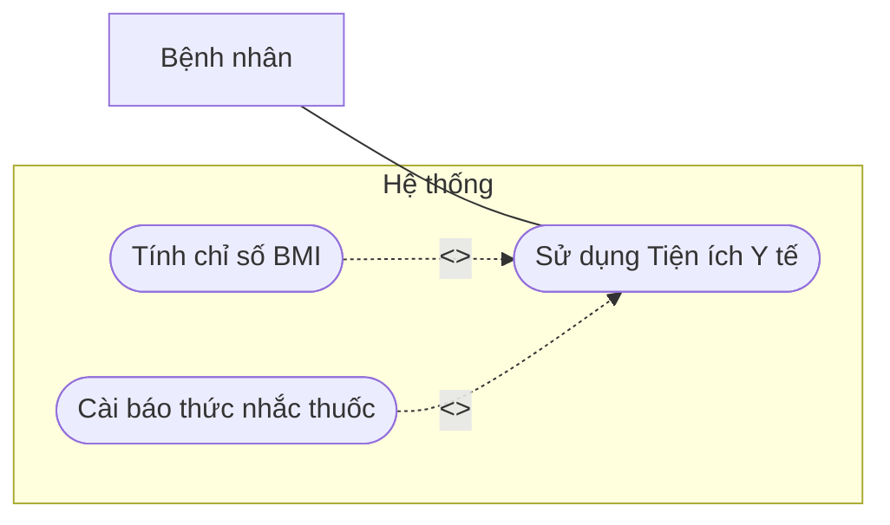

<br>
<div align="center"><i>Bảng 3.10 Kịch bản Cài đặt Báo thức nhắc uống thuốc & Tính BMI</i></div>

<table border="1" style="border-collapse: collapse; width: 100%; margin-bottom: 20px;">
  <tr><td style="width: 25%; padding: 8px;"><b>Tên use case</b></td><td style="padding: 8px;"><b>Sử dụng Tiện ích Y tế</b></td></tr>
  <tr><td style="padding: 8px;"><b>Tác nhân chính</b></td><td style="padding: 8px;">Bệnh nhân</td></tr>
  <tr><td style="padding: 8px;"><b>Tiền điều kiện</b></td><td style="padding: 8px;">Mở ứng dụng Mobile App</td></tr>
  <tr><td style="padding: 8px;"><b>Hậu điều kiện</b></td><td style="padding: 8px;">Thiết bị cài đặt Push Local / Hiển thị BMI</td></tr>
  <tr><td colspan="2" style="padding: 8px;"><b>Kịch bản chính</b><br>- <b>Tính BMI:</b> Nhập Chiều cao, Cân nặng. Hệ thống báo kết quả gầy/béo/bình thường.<br>- <b>Nhắc thuốc:</b> Chọn giờ và tên thuốc, Ứng dụng đặt báo thức nội bộ (Push Local Notification). Đến giờ điện thoại tự động đổ chuông nhắc nhở.</td></tr>
  <tr><td colspan="2" style="padding: 8px;"><b>Ngoại lệ</b><br>Không có</td></tr>
</table>

---

### [PHÂN HỆ CHUYÊN MÔN]

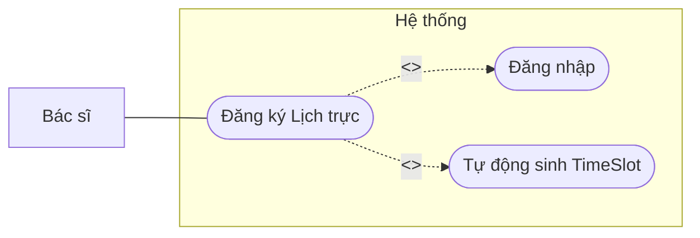

<br>
<div align="center"><i>Bảng 3.11 Kịch bản Đăng ký Lịch làm việc (Ca trực)</i></div>

<table border="1" style="border-collapse: collapse; width: 100%; margin-bottom: 20px;">
  <tr><td style="width: 25%; padding: 8px;"><b>Tên use case</b></td><td style="padding: 8px;"><b>Đăng ký Lịch trực</b></td></tr>
  <tr><td style="padding: 8px;"><b>Tác nhân chính</b></td><td style="padding: 8px;">Bác sĩ</td></tr>
  <tr><td style="padding: 8px;"><b>Tiền điều kiện</b></td><td style="padding: 8px;">Đăng nhập vai trò Bác sĩ</td></tr>
  <tr><td style="padding: 8px;"><b>Hậu điều kiện</b></td><td style="padding: 8px;">Các TimeSlot được sinh ra</td></tr>
  <tr><td colspan="2" style="padding: 8px;"><b>Kịch bản chính</b><br>1. Bác sĩ chọn Ngày và Ca trực muốn làm việc.<br>2. Hệ thống duyệt tự động và sinh ra các TimeSlot (ví dụ: mỗi 30 phút).<br>3. Gán phòng khám và công khai lịch lên hệ thống cho Bệnh nhân đặt.</td></tr>
  <tr><td colspan="2" style="padding: 8px;"><b>Ngoại lệ</b><br>1. Trùng ca: Báo lỗi đã có ca trực trong khung giờ đó.</td></tr>
</table>

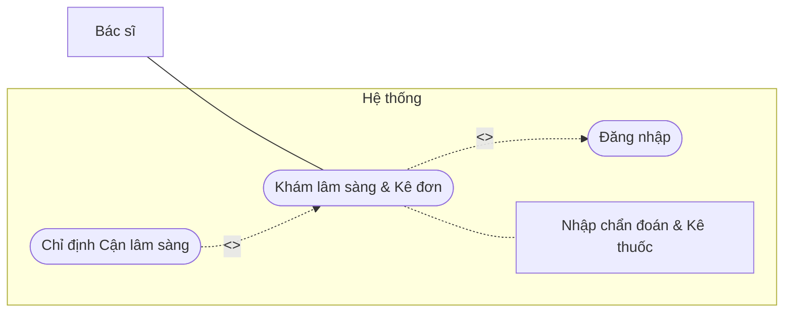

<br>
<div align="center"><i>Bảng 3.12 Kịch bản Khám bệnh và Kê đơn</i></div>

<table border="1" style="border-collapse: collapse; width: 100%; margin-bottom: 20px;">
  <tr><td style="width: 25%; padding: 8px;"><b>Tên use case</b></td><td style="padding: 8px;"><b>Khám lâm sàng & Kê đơn</b></td></tr>
  <tr><td style="padding: 8px;"><b>Tác nhân chính</b></td><td style="padding: 8px;">Bác sĩ</td></tr>
  <tr><td style="padding: 8px;"><b>Tiền điều kiện</b></td><td style="padding: 8px;">Có bệnh nhân đang chờ (Paid)</td></tr>
  <tr><td style="padding: 8px;"><b>Hậu điều kiện</b></td><td style="padding: 8px;">Ca khám hoàn thành, Đơn thuốc được lưu</td></tr>
  <tr><td colspan="2" style="padding: 8px;"><b>Kịch bản chính</b><br>1. Bác sĩ gọi bệnh nhân vào khám (Đổi status sang processing).<br>2. Nhập chẩn đoán y khoa.<br>3. Thêm thuốc từ danh mục, ấn định liều lượng.<br>4. Nhấn "Hoàn thành". Hệ thống lưu Đơn thuốc và đẩy thông báo cho bệnh nhân.</td></tr>
  <tr><td colspan="2" style="padding: 8px;"><b>Ngoại lệ</b><br>1. Cần xét nghiệm thêm: Bác sĩ chỉ định CLS, ca khám tạm dừng chờ kết quả KTV.</td></tr>
</table>

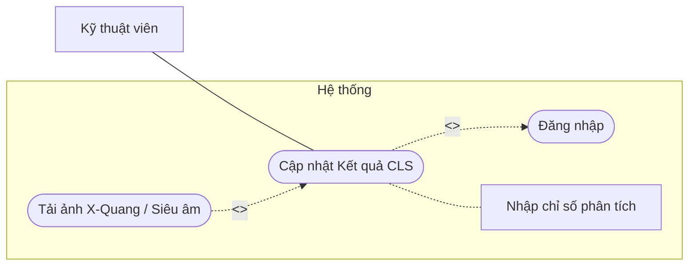

<br>
<div align="center"><i>Bảng 3.13 Kịch bản Chỉ định & Cập nhật Kết quả Cận lâm sàng</i></div>

<table border="1" style="border-collapse: collapse; width: 100%; margin-bottom: 20px;">
  <tr><td style="width: 25%; padding: 8px;"><b>Tên use case</b></td><td style="padding: 8px;"><b>Cập nhật Kết quả CLS</b></td></tr>
  <tr><td style="padding: 8px;"><b>Tác nhân chính</b></td><td style="padding: 8px;">Kỹ thuật viên (LabTech)</td></tr>
  <tr><td style="padding: 8px;"><b>Tiền điều kiện</b></td><td style="padding: 8px;">Bệnh nhân đã thanh toán phí chỉ định CLS</td></tr>
  <tr><td style="padding: 8px;"><b>Hậu điều kiện</b></td><td style="padding: 8px;">Bản ghi LabResult được tạo</td></tr>
  <tr><td colspan="2" style="padding: 8px;"><b>Kịch bản chính</b><br>1. KTV xem hàng đợi chờ xét nghiệm.<br>2. Thực hiện xét nghiệm máu / X-Quang / Siêu âm.<br>3. Điền thông số kết quả và tải ảnh lên hệ thống.<br>4. Bấm hoàn thành. Thông báo tự động trả về phòng khám lâm sàng.</td></tr>
  <tr><td colspan="2" style="padding: 8px;"><b>Ngoại lệ</b><br>1. Bệnh nhân chưa đóng tiền phí xét nghiệm: Dịch vụ không hiển thị trong danh sách chờ của KTV.</td></tr>
</table>

---

### [PHÂN HỆ QUẢN TRỊ ADMIN]

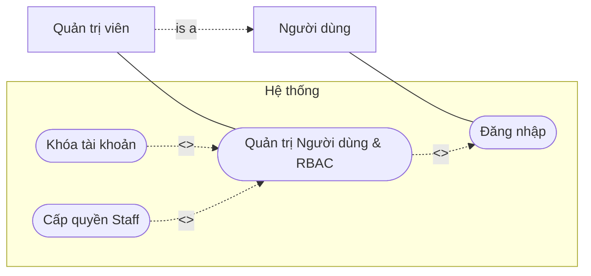

<br>
<div align="center"><i>Bảng 3.14 Kịch bản Quản trị Người dùng & Phân quyền</i></div>

<table border="1" style="border-collapse: collapse; width: 100%; margin-bottom: 20px;">
  <tr><td style="width: 25%; padding: 8px;"><b>Tên use case</b></td><td style="padding: 8px;"><b>Quản lý Người dùng & Phân quyền RBAC</b></td></tr>
  <tr><td style="padding: 8px;"><b>Tác nhân chính</b></td><td style="padding: 8px;">Quản trị viên (Admin)</td></tr>
  <tr><td style="padding: 8px;"><b>Tiền điều kiện</b></td><td style="padding: 8px;">Đăng nhập quyền Admin</td></tr>
  <tr><td style="padding: 8px;"><b>Hậu điều kiện</b></td><td style="padding: 8px;">Tài khoản bị thay đổi quyền hoặc bị khóa</td></tr>
  <tr><td colspan="2" style="padding: 8px;"><b>Kịch bản chính</b><br>1. <b>Phân quyền:</b> Cấp các quyền con (vd: manage_users, manage_appointments) cho Staff.<br>2. <b>Khóa tài khoản:</b> Block User, hệ thống tăng Token_Version để kích văng tài khoản đó ra khỏi mọi phiên đăng nhập ngay lập tức.</td></tr>
  <tr><td colspan="2" style="padding: 8px;"><b>Ngoại lệ</b><br>Không có</td></tr>
</table>

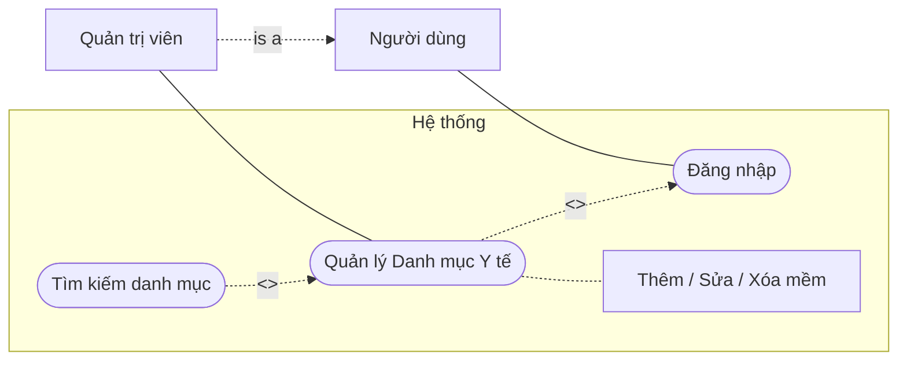

<br>
<div align="center"><i>Bảng 3.15 Kịch bản Quản lý Danh mục Y tế (Thuốc, Vắc-xin)</i></div>

<table border="1" style="border-collapse: collapse; width: 100%; margin-bottom: 20px;">
  <tr><td style="width: 25%; padding: 8px;"><b>Tên use case</b></td><td style="padding: 8px;"><b>Quản lý Danh mục (Soft Delete)</b></td></tr>
  <tr><td style="padding: 8px;"><b>Tác nhân chính</b></td><td style="padding: 8px;">Admin</td></tr>
  <tr><td style="padding: 8px;"><b>Tiền điều kiện</b></td><td style="padding: 8px;">Đăng nhập quyền Admin/Staff phù hợp</td></tr>
  <tr><td style="padding: 8px;"><b>Hậu điều kiện</b></td><td style="padding: 8px;">Danh mục được cập nhật an toàn</td></tr>
  <tr><td colspan="2" style="padding: 8px;"><b>Kịch bản chính</b><br>1. Admin Thêm / Sửa / Xóa một loại thuốc hoặc vắc-xin.<br>2. Khi Xóa, hệ thống đổi trạng thái `is_active = false` thay vì xóa cứng (cơ chế Soft Delete). Nhờ vậy các đơn thuốc cũ của bệnh nhân trước đó không bị lỗi mất dữ liệu.</td></tr>
  <tr><td colspan="2" style="padding: 8px;"><b>Ngoại lệ</b><br>1. Nhập thiếu trường bắt buộc: Báo lỗi Validation từ Backend.</td></tr>
</table>

## IV. CHI TIẾT SEQUENCE DIAGRAM TOÀN BỘ CÁC LUỒNG NGHIỆP VỤ

### [PHÂN HỆ BỆNH NHÂN]

#### Luồng 1. Xác Thực & Phân Quyền (Đăng ký OTP, Đăng nhập)

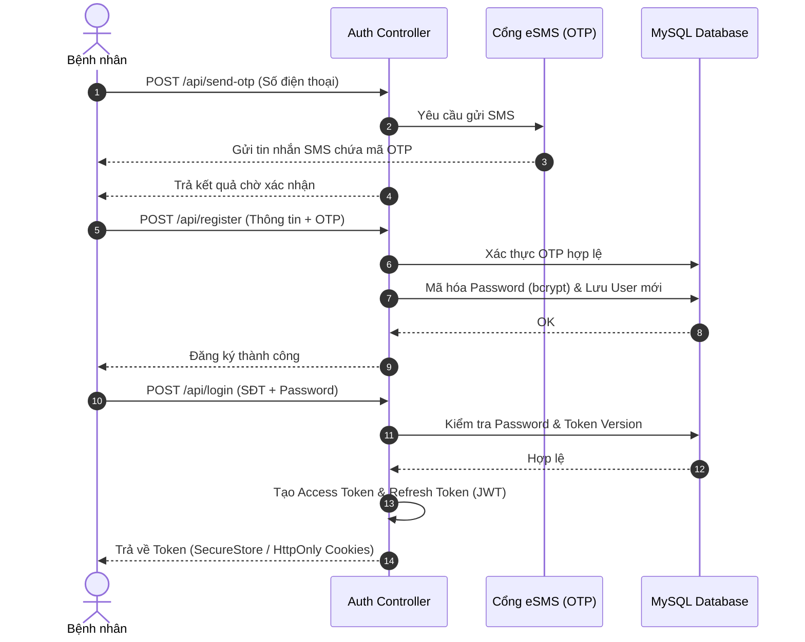

#### Luồng 2. Quản lý Hồ sơ y tế & Thẻ Y Tế Số

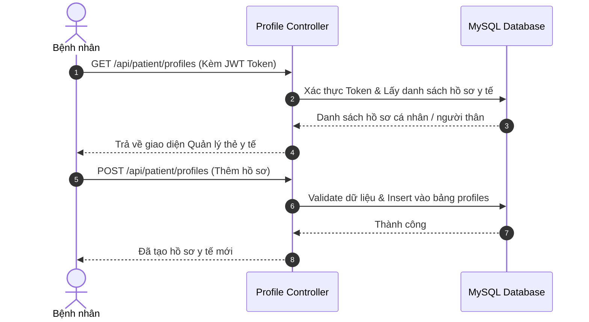

#### Luồng 3. Đặt Lịch Khám Lâm Sàng (Cơ chế Pessimistic Locking)

```mermaid
sequenceDiagram
    autonumber
    actor Patient as Bệnh nhân
    participant API as Appointment Controller
    participant DB as MySQL Database
    participant PayOS as Cổng Thanh Toán

    Patient->>API: POST /api/appointments (Chọn Bác sĩ, Ngày, Slot)
    API->>DB: Bắt đầu Transaction
    API->>DB: Truy vấn TimeSlot + Khóa bi quan (FOR UPDATE)

    alt Slot đã bị người khác đặt
        DB-->>API: Lỗi trùng lịch
        API-->>Patient: Trả về lỗi "Khung giờ không khả dụng"
    else Slot khả dụng
        API->>DB: Tạo Appointment (Status="pending", ExpiresAt=Now+1m)
        DB-->>API: Lưu thành công, Commit Transaction
        API->>PayOS: Khởi tạo dữ liệu thanh toán phí khám
        PayOS-->>API: Trả về Payment QR
        API-->>Patient: Yêu cầu thanh toán trong vòng 1 phút
    end
```

#### Luồng 4. Thanh Toán Viện Phí & Đồng Bộ WebSocket Real-time

```mermaid
sequenceDiagram
    autonumber
    actor User as Bệnh nhân
    participant App as Mobile/Web App
    participant API as Payment Controller
    participant PayOS as Cổng thanh toán PayOS / VNPay
    participant WS as WebSocket Hub
    participant DB as MySQL

    User->>App: Chọn Thanh toán (Khám/Tiêm chủng/CLS)
    App->>API: POST /api/payments
    API->>DB: Tạo bản ghi Payment
    API->>PayOS: Khởi tạo dữ liệu giao dịch VietQR / VNPay
    PayOS-->>API: Link thanh toán & QRCode
    API-->>App: Trả về thông tin mã QR

    %% Bệnh nhân quét mã
    User->>PayOS: Quét mã chuyển khoản qua App Ngân hàng

    %% Webhook và WebSocket
    PayOS->>API: Webhook: Xác nhận giao dịch thành công (S2S)
    API->>DB: Cập nhật Payment = Paid & Cập nhật Status Cuộc hẹn
    API->>WS: Push sự kiện thanh toán thành công qua Socket
    WS-->>App: Nhận tín hiệu Real-time
    App-->>User: Tự động chuyển sang màn hình "Thanh toán thành công"
```

#### Luồng 5. Đăng ký Tiêm chủng Vắc-xin & Trừ Tồn Kho

```mermaid
sequenceDiagram
    autonumber
    actor Patient as Bệnh nhân
    participant API as Vaccine Controller
    participant DB as MySQL Database

    Patient->>API: POST /api/vaccine/booking (Chọn Vắc-xin, Ngày)
    API->>DB: Kiểm tra số lượng tồn kho (Stock > 0)

    alt Hết Vắc-xin
        DB-->>API: Lỗi tồn kho
        API-->>Patient: Báo lỗi "Vắc-xin tạm hết hàng"
    else Còn tồn kho
        API->>DB: Trừ trực tiếp tồn kho (Stock = Stock - 1)
        API->>DB: Tạo bản ghi Registration (Trạng thái Pending)
        DB-->>API: OK
        API-->>Patient: Chuyển hướng sang giao diện Thanh toán
    end
```

#### Luồng 6. Xem Bệnh Án, Đánh giá Y Đức & Xuất Hóa Đơn VAT

```mermaid
sequenceDiagram
    autonumber
    actor Patient as Bệnh nhân
    participant API as Service Controller
    participant Cloudinary
    participant DB as MySQL Database

    %% Đánh giá Y đức
    Patient->>API: POST /api/feedbacks (Review Rating 5 sao)
    API->>DB: Lưu Feedback cho Bác sĩ tương ứng
    DB-->>API: OK

    %% Xuất hóa đơn VAT
    Patient->>API: POST /api/vat-invoice (Mã số thuế, Tên công ty)
    API->>DB: Kiểm tra Giao dịch hợp lệ & Chưa từng xuất VAT
    API->>API: Kết xuất file PDF Hóa đơn điện tử có đính kèm chữ ký số
    API->>Cloudinary: Upload PDF lên Cloud Storage
    Cloudinary-->>API: Trả về URL File
    API->>DB: Lưu URL vào CSDL
    API-->>Patient: Cung cấp link tải Hóa đơn VAT
```

---

### [PHÂN HỆ CHUYÊN MÔN: BÁC SĨ & KỸ THUẬT VIÊN]

#### Luồng 7. Đăng ký Lịch Làm Việc & Tự Động Sinh TimeSlot

```mermaid
sequenceDiagram
    autonumber
    actor Doctor as Bác sĩ
    participant API as Schedule Controller
    participant DB as MySQL

    Doctor->>API: POST /api/doctor/schedules/request (Ngày, Ca trực)
    API->>DB: Tạo DoctorSchedule mới (Trạng thái Approved)
    API->>DB: Auto-generate các TimeSlot (Mỗi slot 30 phút)
    API->>DB: Phân bổ lịch vào một Phòng khám trống
    DB-->>API: Hoàn tất
    API-->>Doctor: Đã tạo lịch làm việc thành công
```

#### Luồng 8. Khám Bệnh Lâm Sàng, Chẩn Đoán & Kê Đơn Thuốc

```mermaid
sequenceDiagram
    autonumber
    actor Doctor as Bác sĩ
    participant API as Clinical Controller
    participant Notify as Notification Service
    participant DB as MySQL Database

    Doctor->>API: GET /api/doctor/appointments/today
    API->>DB: Lấy hàng đợi bệnh nhân (Paid)
    DB-->>API: Trả danh sách chờ
    API-->>Doctor: Hiển thị lên màn hình làm việc

    Doctor->>API: Cập nhật ca khám = "processing" (Bắt đầu khám)
    API->>DB: Lưu trạng thái
    Doctor->>API: POST /api/prescriptions (Kê đơn thuốc)
    API->>DB: Trừ tồn kho thuốc & Lưu đơn thuốc điện tử
    API->>DB: Đổi trạng thái ca khám = "completed"
    API->>Notify: Gửi thông báo có Đơn thuốc mới đến điện thoại Bệnh nhân
    API-->>Doctor: Kết thúc luồng khám bệnh
```

#### Luồng 9. Chỉ Định Cận Lâm Sàng & Cập Nhật Kết Quả Xét Nghiệm (KTV)

```mermaid
sequenceDiagram
    autonumber
    actor Doctor as Bác sĩ
    actor LabTech as KTV Cận lâm sàng
    participant API as Lab Controller
    participant DB as MySQL Database

    %% Bác sĩ chỉ định
    Doctor->>API: Chỉ định Dịch vụ CLS (Siêu âm, X-Quang, Máu)
    API->>DB: Tạo AppointmentService (Chờ thanh toán)
    Note over Doctor, API: Bệnh nhân nhận thông báo & Thanh toán phí CLS
    API->>DB: Status -> Paid

    %% KTV thao tác
    LabTech->>API: Xem hàng đợi dịch vụ CLS
    API->>DB: Truy vấn các dịch vụ đã Paid
    DB-->>API: Danh sách chờ
    API-->>LabTech: Hiển thị

    LabTech->>API: Nhập kết quả phân tích & Hoàn thành
    API->>DB: Đổi trạng thái = "completed"
    API->>DB: Sinh file LabResult lưu vào CSDL
    API-->>LabTech: Lưu kết quả thành công
```

---

### [PHÂN HỆ QUẢN TRỊ (ADMIN) & TÁC VỤ NGẦM]

#### Luồng 10. Quản Trị Người Dùng, Phân Quyền & Khóa Tài Khoản

```mermaid
sequenceDiagram
    autonumber
    actor Admin as Quản Trị Viên
    participant API as Admin Controller
    participant DB as MySQL Database

    %% Cấp quyền Staff
    Admin->>API: POST /api/admin/staff/promote (Cấp quyền)
    API->>DB: Update quyền vào bảng trung gian user_permissions
    API-->>Admin: Phân quyền thành công

    %% Khóa tài khoản
    Admin->>API: DELETE /api/admin/users/:id (Khóa)
    API->>DB: Update is_blocked = true
    API->>DB: Update token_version = token_version + 9999 (Kích xuất khỏi mọi thiết bị)
    DB-->>API: OK
    API-->>Admin: Đã khóa User vĩnh viễn
```

#### Luồng 11. Quản Lý Danh Mục Thuốc (Quy trình Xóa Mềm - Soft Delete)

```mermaid
sequenceDiagram
    autonumber
    actor Admin as Quản Trị Viên
    participant API as Catalog Controller
    participant DB as MySQL Database

    Admin->>API: POST /api/medicines (Thêm thuốc mới)
    API->>DB: Insert bảng medicines
    DB-->>API: OK

    Admin->>API: DELETE /api/medicines/:id (Xóa thuốc)
    API->>DB: Update is_active = false (Xóa mềm - Soft Delete)
    Note right of DB: Việc xóa mềm giúp bảo toàn lịch sử đơn thuốc của bệnh nhân cũ không bị lỗi dữ liệu liên kết
    DB-->>API: OK
    API-->>Admin: Xóa thành công
```

#### Luồng 12. Tác Vụ Ngầm Hệ Thống (Background Workers)

```mermaid
sequenceDiagram
    autonumber
    participant Worker as Background Service
    participant DB as MySQL
    participant Notification as Push Notification / SMS

    loop Định kỳ mỗi 30 Giây
        %% Hủy lịch chưa thanh toán
        Worker->>DB: checkExpiredPendingAppointments()
        DB-->>Worker: Lấy các lịch "pending" quá hạn thanh toán (> 1 phút)
        Worker->>DB: Cập nhật Status="cancelled", tự động hoàn trả TimeSlot

        %% Nhắc lịch sắp diễn ra
        Worker->>DB: checkUpcomingAppointments()
        DB-->>Worker: Lấy lịch cách hiện tại <= 5 phút
        Worker->>Notification: Gửi Push Notification nhắc nhở bệnh nhân chuẩn bị vào khám

        %% Nhắc tái khám
        Worker->>DB: checkRevisitReminders()
        DB-->>Worker: Quét toa thuốc có lịch hẹn tái khám vào ngày mai
        Worker->>Notification: Báo bệnh nhân chủ động đặt lại lịch khám mới
    end
```
